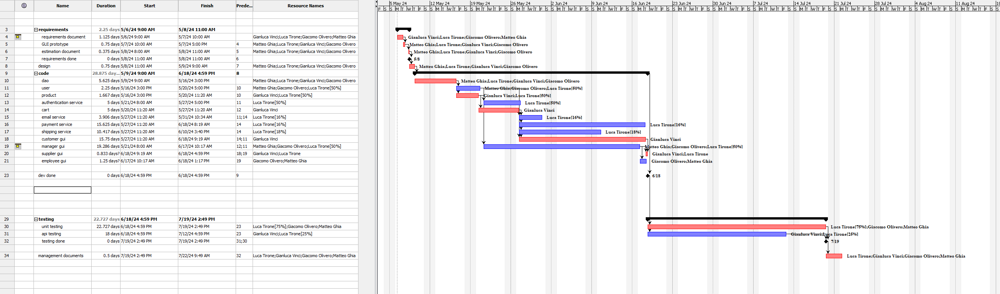

# Project Estimation - FUTURE

Authors:
[Matteo Ghia](mailto:s331347@studenti.polito.it),
[Giacomo Olivero](mailto:s323349@studenti.polito.it),
[Luca Tirone](mailto:s292901@studenti.polito.it),
[Gianluca Vinci](mailto:s331364@studenti.polito.it)

Date: May 5th, 2024

<!-- Here is V1 since it's V1 in RequirementsDocumentV2 -->
Version: V1 - description of EZElectronics in FUTURE form (as proposed by the team)

## Estimation approach

Consider the EZElectronics  project in FUTURE version (as proposed by your team in requirements V2), assume that you are going to develop the project INDEPENDENT of the deadlines of the course, and from scratch (not from V1)

## Estimate by size

|                                                                                                         | Estimate |
| ------------------------------------------------------------------------------------------------------- | :------: |
| NC =  Estimated number of classes to be developed                                                       |    37    |
| A = Estimated average size per class, in LOC                                                            |   500    |
| S = Estimated size of project, in LOC (= NC * A)                                                        |  18500   |
| E = Estimated effort, in person hours (here use productivity 10 LOC per person hour)                    |   1850   |
| C = Estimated cost, in euro (here use 1 person hour cost = 30 euro)                                     |  55500   |
| Estimated calendar time, in calendar weeks (Assume team of 4 people, 8 hours per day, 5 days per week ) |    12    |

## Estimate by product decomposition

| component name       | Estimated effort (person hours) |
| -------------------- | :-----------------------------: |
| requirement document |               30                |
| GUI prototype        |               25                |
| design document      |               25                |
| code                 |              1100               |
| unit tests           |               500               |
| api tests            |               300               |
| management documents |               20                |

## Estimate by activity decomposition

| Activity name         | Estimated effort (person hours) |
| --------------------- | :-----------------------------: |
| requirements document |               36                |
| GUI prototype         |               24                |
| estimation document   |               12                |
| design                |               24                |
| code                  |               951               |
| unit tests            |               500               |
| api tests             |               180               |
| management documents  |               16                |

## Summary

|                                    | Estimated effort | Estimated duration |
| ---------------------------------- | :--------------: | :----------------: |
| estimate by size                   |       1850       |         12         |
| estimate by product decomposition  |       2000       |         13         |
| estimate by activity decomposition |       1743       |         11         |

The estimated effort of the different approaches is quite similar, but the estimated duration is different.
This can be explained by the different distribution of the effort among the activities: the activity decomposition approach is the one that estimates the shortest duration, as it distributes the effort more evenly among the activities, thanks to the detailed analysis of the project's tasks in the Gantt chart.
