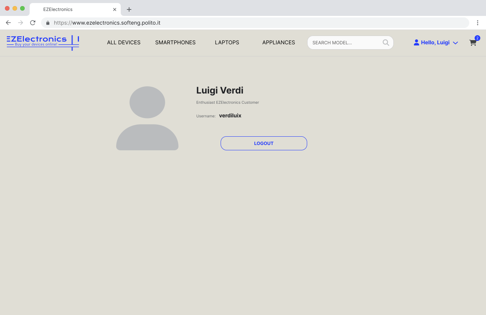
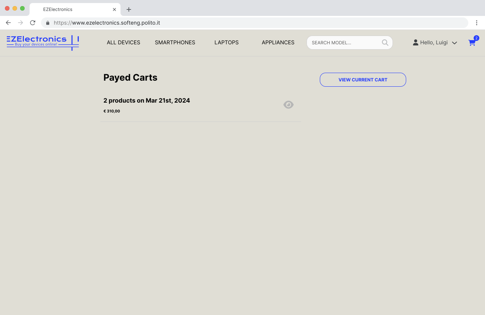

# Graphical User Interface Prototype - CURRENT

Authors:
[Matteo Ghia](mailto:s331347@studenti.polito.it),
[Giacomo Olivero](mailto:s323349@studenti.polito.it),
[Luca Tirone](mailto:s292901@studenti.polito.it),
[Gianluca Vinci](mailto:s331364@studenti.polito.it)

Date: May 5th, 2024

Version: V1 - description of EZElectronics in CURRENT form (as received by teachers)

## Contents
- [Graphical User Interface Prototype - CURRENT](#graphical-user-interface-prototype---current)
  - [Contents](#contents)
  - [Common parts](#common-parts)
    - [Homepage - Login](#homepage---login)
    - [Customer registration](#customer-registration)
    - [User profile view](#user-profile-view)
  - [Customer view](#customer-view)
    - [List of products](#list-of-products)
    - [Cart view](#cart-view)
    - [List of payed carts](#list-of-payed-carts)
  - [Manager view](#manager-view)
    - [Product management](#product-management)
    - [Add single product](#add-single-product)
    - [Add multiple products](#add-multiple-products)

## Common parts

### Homepage - Login

**Used in:**
- [Use Case 2: User login](./RequirementsDocumentV1.md#use-case-2-uc2-user-login)

**Refers to:**
- FR1.1

### Customer registration

**Used in:**
- [Use Case 1: User registration](./RequirementsDocumentV1.md#use-case-1-uc1-user-registration)

**Refers to:**
- FR1.3

### User profile view

**Refers to:**
- FR2.1

## Customer view

### List of products

**Used in:**
- [Use Case 6: Search for products](./RequirementsDocumentV1.md#use-case-6-uc6-search-for-products) (customer view)
- [Use Case 7: Add product to cart](./RequirementsDocumentV1.md#use-case-7-uc7-add-product-to-cart)

**Refers to:**
- FR1.2
- FR3.4
- FR3.5
- FR4.1

### Cart view

**Used in:**
- [Use Case 8: Remove a product from the cart](./RequirementsDocumentV1.md#use-case-8-uc8-remove-a-product-from-the-cart)
- [Use Case 9: Pay the current cart](./RequirementsDocumentV1.md#use-case-9-uc9-pay-the-current-cart)

**Refers to:**
- FR1.2
- FR4.1
- FR4.3
- FR4.4
- FR4.6

### List of payed carts

**Refers to:**
- FR4.5

## Manager view

### Product management

**Used in:**
- [Use Case 3: Add a product](./RequirementsDocumentV1.md#use-case-3-uc3-add-a-product)
- [Use Case 4: Sell a product](./RequirementsDocumentV1.md#use-case-4-uc4-sell-a-product)
- [Use Case 5: Delete a product](./RequirementsDocumentV1.md#use-case-5-uc5-delete-a-product)
- [Use Case 6: Search for products](./RequirementsDocumentV1.md#use-case-6-uc6-search-for-products) (manager view)

**Refers to:**
- FR1.2
- FR3

### Add single product

**Used in:**
- [Use Case 3: Add a product](./RequirementsDocumentV1.md#use-case-3-uc3-add-a-product)

**Refers to:**
- FR3.1.1

### Add multiple products

**Used in:**
- [Use Case 3: Add a product](./RequirementsDocumentV1.md#use-case-3-uc3-add-a-product)
  - [Scenario 3.2: Add multiple products](./RequirementsDocumentV1.md#scenario-32-add-multiple-products)

**Refers to:**
- FR3.1.2

