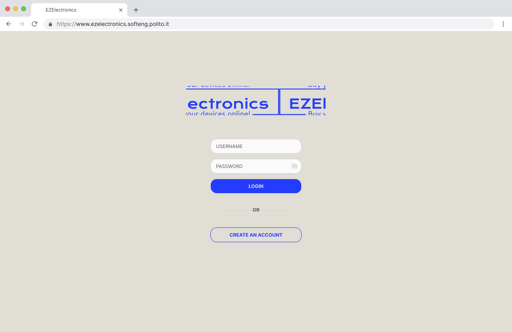
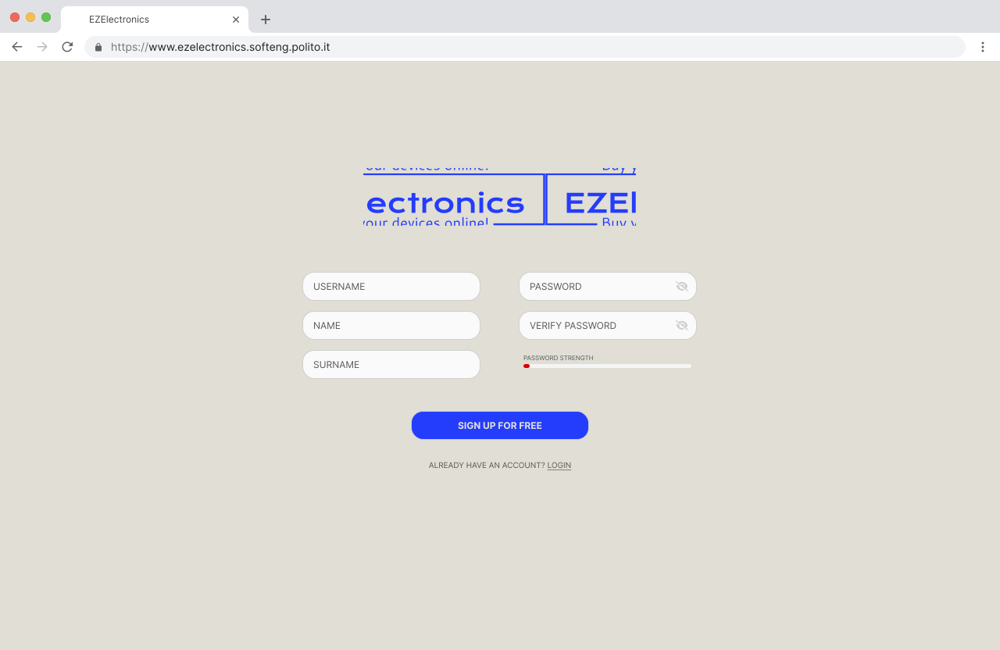
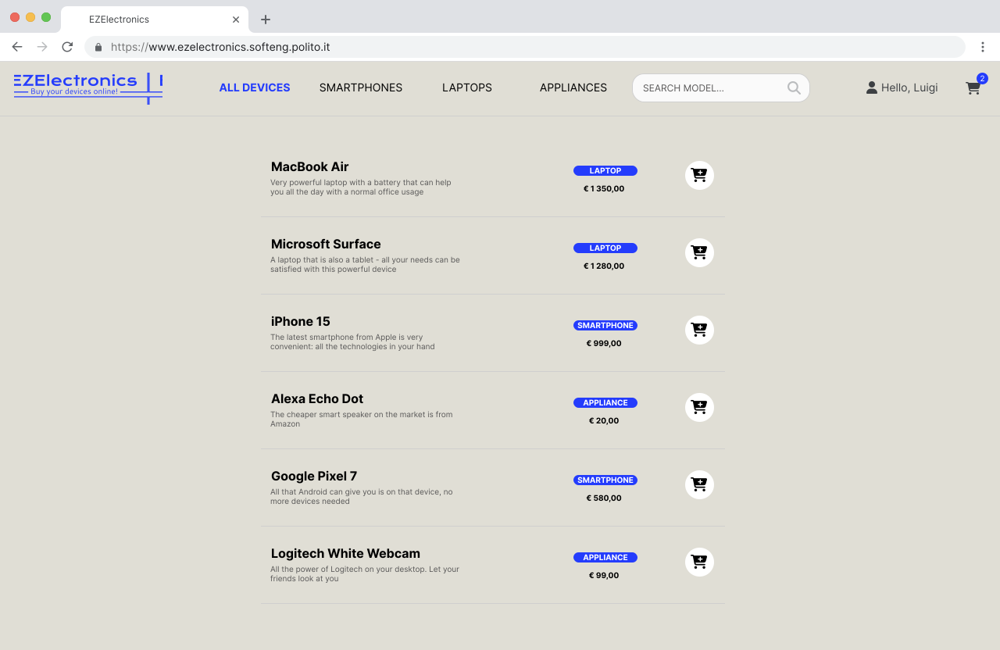
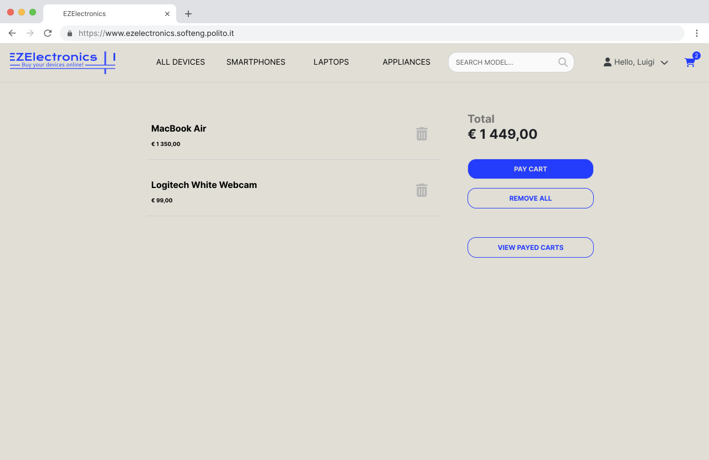
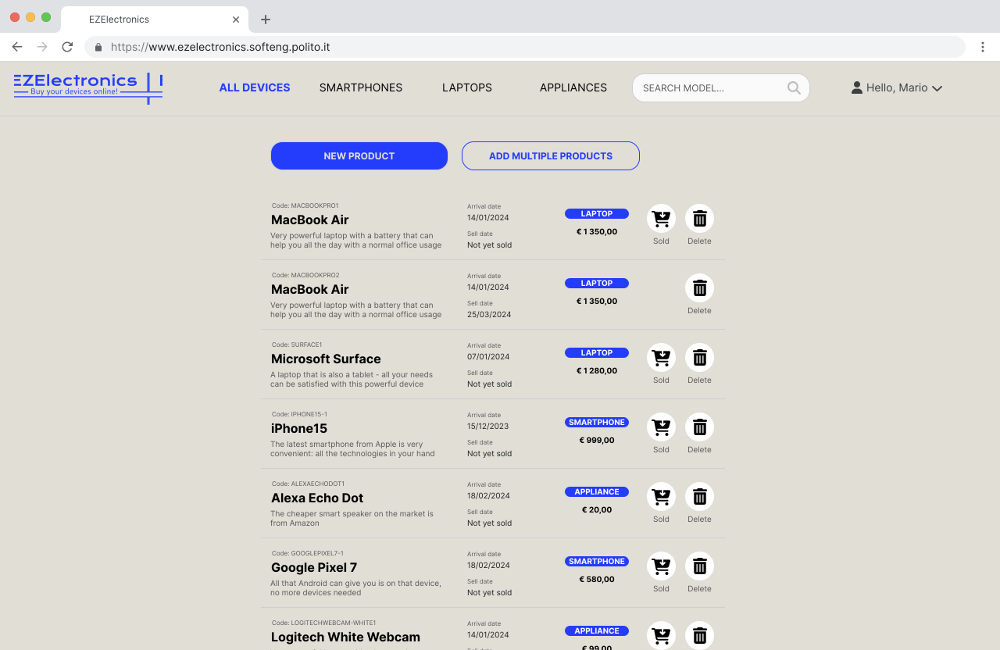
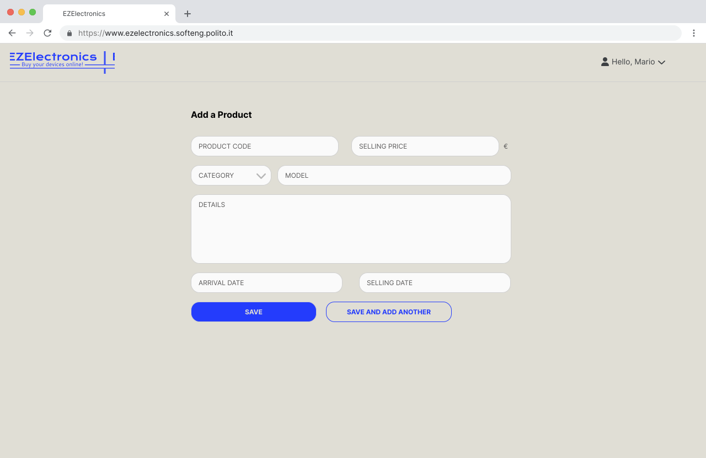
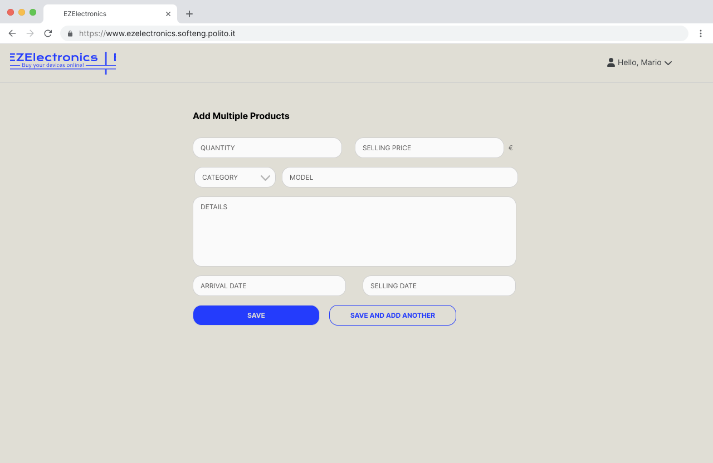

# Graphical User Interface Prototype - CURRENT

Authors:
[Matteo Ghia](mailto:s331347@studenti.polito.it),
[Giacomo Olivero](mailto:s323349@studenti.polito.it),
[Luca Tirone](mailto:s292901@studenti.polito.it),
[Gianluca Vinci](mailto:s331364@studenti.polito.it)

Date: May 5th, 2024

Version: V1 - description of EZElectronics in CURRENT form (as received by teachers)

## Contents
- [Graphical User Interface Prototype - CURRENT](#graphical-user-interface-prototype---current)
  - [Contents](#contents)
  - [Common parts](#common-parts)
    - [Homepage - Login](#homepage---login)
    - [Customer registration](#customer-registration)
  - [Customer view](#customer-view)
    - [List of products](#list-of-products)
    - [Cart view](#cart-view)
  - [Manager view](#manager-view)
    - [Product management](#product-management)
    - [Add single product](#add-single-product)
    - [Add multiple products](#add-multiple-products)

## Common parts

### Homepage - Login

### Customer registration

## Customer view

### List of products

### Cart view

## Manager view

### Product management

### Add single product

### Add multiple products

