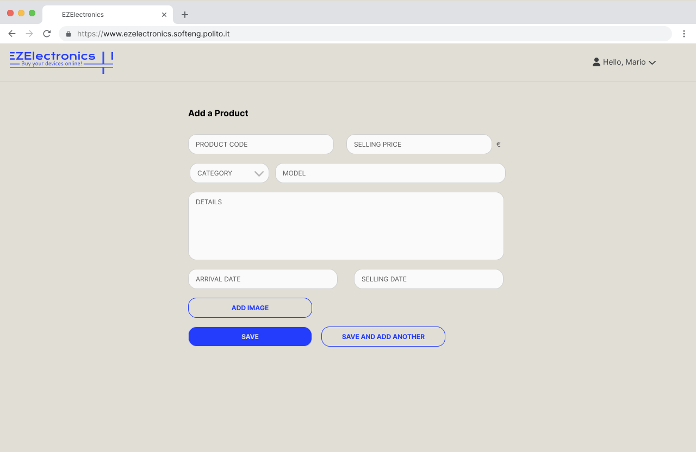

# Graphical User Interface Prototype - FUTURE

Authors:
[Matteo Ghia](mailto:s331347@studenti.polito.it),
[Giacomo Olivero](mailto:s323349@studenti.polito.it),
[Luca Tirone](mailto:s292901@studenti.polito.it),
[Gianluca Vinci](mailto:s331364@studenti.polito.it)

Date: May 5th, 2024

Version: V1 - description of EZElectronics in FUTURE form (as proposed by the team)

## Contents
- [Graphical User Interface Prototype - FUTURE](#graphical-user-interface-prototype---future)
  - [Contents](#contents)
  - [Common parts](#common-parts)
    - [Homepage and Login](#homepage-and-login)
    - [Customer registration](#customer-registration)
    - [User profile view](#user-profile-view)
  - [Customer view](#customer-view)
    - [List of products](#list-of-products)
    - [Cart view](#cart-view)
    - [Cart checkout](#cart-checkout)
    - [List of payed carts](#list-of-payed-carts)
  - [Manager view](#manager-view)
    - [Inventory management](#inventory-management)
    - [Add single product](#add-single-product)
    - [Add multiple products](#add-multiple-products)
    - [User management](#user-management)
    - [Add single user](#add-single-user)
  - [Employee view](#employee-view)
    - [Inventory management](#inventory-management-1)
  - [Suppliers view](#suppliers-view)
    - [List of products](#list-of-products-1)
    - [Other pages seen by suppliers](#other-pages-seen-by-suppliers)

## Common parts

### Homepage and Login

**Used by:**
- [Use Case 2: User login](./RequirementsDocumentV2.md#use-case-2-uc2-user-login)
- [Use Case 6: Search for products](./RequirementsDocumentV2.md#use-case-6-uc6-search-for-products) (unauthenticated user view)

**Refers to:**
- FR1.1
- FR1.4
- FR3.4
- FR3.5

### Customer registration

**Used by:**
- [Use Case 1: User registration](./RequirementsDocumentV2.md#use-case-1-uc1-user-registration)

**Refers to:**
- FR2.1.1

### User profile view

**Used by:**
- [Use Case 13: Change password](./RequirementsDocumentV2.md#use-case-13-uc13-change-password)

**Refers to:**
- FR1.2
- FR1.3
- FR1.5

## Customer view

### List of products

**Used by:**
- [Use Case 6: Search for products](./RequirementsDocumentV2.md#use-case-6-uc6-search-for-products) (customer view)
- [Use Case 7: Add product to cart](./RequirementsDocumentV2.md#use-case-7-uc7-add-product-to-cart)

**Refers to:**
- FR1.2
- FR3.4
- FR3.5
- FR4.2

### Cart view

**Used by:**
- [Use Case 8: Remove a product from the cart](./RequirementsDocumentV2.md#use-case-8-uc8-remove-a-product-from-the-cart)
- [Use Case 9: Pay the current cart](./RequirementsDocumentV2.md#use-case-9-uc9-pay-the-current-cart)

**Refers to:**
- FR1.2
- FR4.1
- FR4.3
- FR4.4
- FR4.6

### Cart checkout

**Used by:**
- [Use Case 9: Pay the current cart](./RequirementsDocumentV2.md#use-case-9-uc9-pay-the-current-cart)

**Refers to:**
- FR4.4

### List of payed carts

**Used by:**
- [Use Case 10: Return a product](./RequirementsDocumentV2.md#use-case-10-uc10-return-a-product)

**Refers to:**
- FR1.2
- FR4.5
- FR5.3

## Manager view

### Inventory management

**Used by:**
- [Use Case 3: Add a product](./RequirementsDocumentV2.md#use-case-3-uc3-add-a-product)
- [Use Case 4: Sell a product](./RequirementsDocumentV2.md#use-case-4-uc4-sell-a-product)
- [Use Case 5: Delete a product](./RequirementsDocumentV2.md#use-case-5-uc5-delete-a-product)
- [Use Case 6: Search for products](./RequirementsDocumentV2.md#use-case-6-uc6-search-for-products) (manager view)
- [Use Case 11: Accept returned product](./RequirementsDocumentV2.md#use-case-11-uc11-accept-returned-product)
- [Use Case 12: Edit a product](./RequirementsDocumentV2.md#use-case-12-uc12-edit-a-product)

**Refers to:**
- FR1.2
- FR3
- FR5.1
- FR5.2

### Add single product

**Used by:**
- [Use Case 3: Add a product](./RequirementsDocumentV2.md#use-case-3-uc3-add-a-product)
- [Use Case 12: Edit a product](./RequirementsDocumentV2.md#use-case-12-uc12-edit-a-product)

**Refers to:**
- FR3.1.1
- FR3.6

### Add multiple products

**Used by:**
- [Use Case 3: Add a product](./RequirementsDocumentV2.md#use-case-3-uc3-add-a-product)
  - [Scenario 3.2](./RequirementsDocumentV2.md#scenario-32)

**Refers to:**
- FR3.1.2

### User management

**Used by:**
- [Use Case 1: User registration](./RequirementsDocumentV2.md#use-case-1-uc1-user-registration)
  - [Scenario 1.7](./RequirementsDocumentV2.md#scenario-17)

**Refers to:**
- FR2

### Add single user

**Used by:**
- [Use Case 1: User registration](./RequirementsDocumentV2.md#use-case-1-uc1-user-registration)
  - [Scenario 1.7](./RequirementsDocumentV2.md#scenario-17)

**Refers to:**
- FR2.1.2

## Employee view

### Inventory management

**Used by:**
- [Use Case 4: Sell a product](./RequirementsDocumentV2.md#use-case-4-uc4-sell-a-product)
- [Use Case 6: Search for products](./RequirementsDocumentV2.md#use-case-6-uc6-search-for-products) (employee view)
- [Use Case 11: Accept returned product](./RequirementsDocumentV2.md#use-case-11-uc11-accept-returned-product)

**Refers to:**
- FR1.2
- FR3.3
- FR3.4
- FR3.5
- FR5.2

## Suppliers view

### List of products

**Used by:**
- [Use Case 3: Add a product](./RequirementsDocumentV2.md#use-case-3-uc3-add-a-product)
- [Use Case 6: Search for products](./RequirementsDocumentV2.md#use-case-6-uc6-search-for-products) (supplier view)

**Refers to:**
- FR1.2
- FR3.1
- FR3.4
- FR3.5

### Other pages seen by suppliers

- [Add single product](#add-single-product)
- [Add multiple products](#add-multiple-products)
