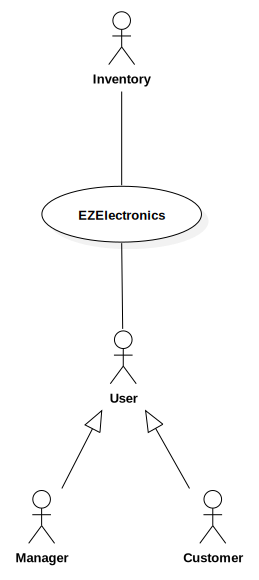
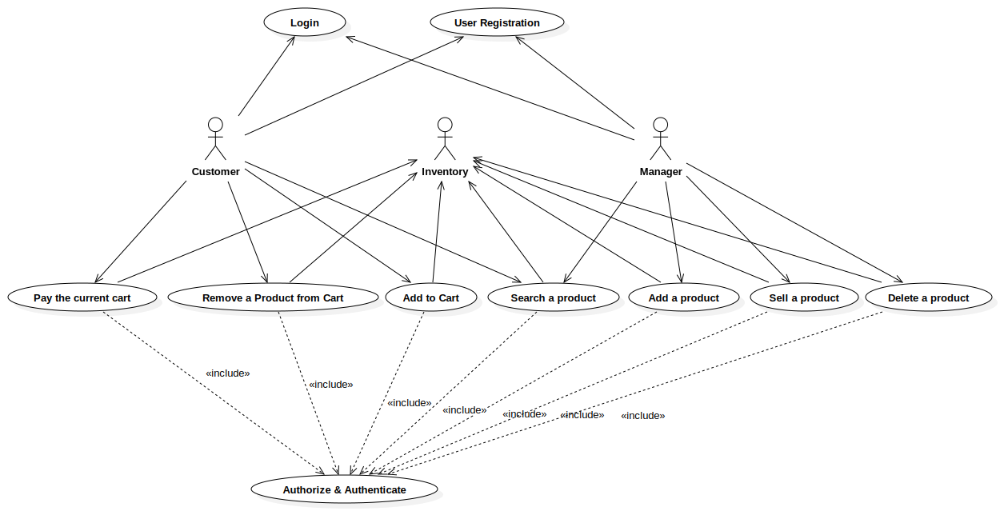
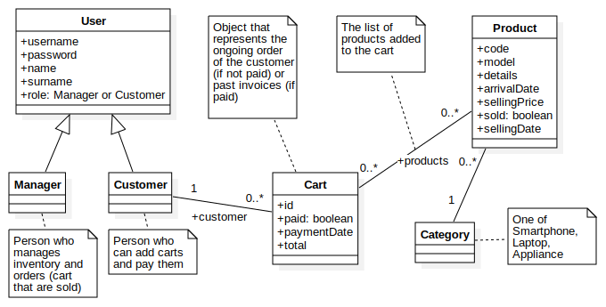
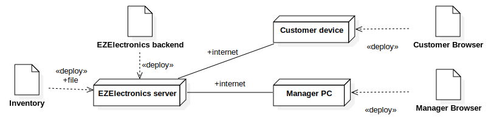

# Requirements Document - current EZElectronics

Authors:
[Matteo Ghia](mailto:s331347@studenti.polito.it),
[Giacomo Olivero](mailto:s323349@studenti.polito.it),
[Luca Tirone](mailto:s292901@studenti.polito.it),
[Gianluca Vinci](mailto:s331364@studenti.polito.it)

Date: May 5th, 2024

Version: V1 - description of EZElectronics in CURRENT form (as received by teachers)

| Version number |      Change      |
| :------------: | :--------------: |
|       V1       | Initial proposal |

# Contents

- [Requirements Document - current EZElectronics](#requirements-document---current-ezelectronics)
- [Contents](#contents)
- [Informal description](#informal-description)
- [Stakeholders](#stakeholders)
- [Context Diagram and interfaces](#context-diagram-and-interfaces)
  - [Context Diagram](#context-diagram)
  - [Interfaces](#interfaces)
- [Stories and personas](#stories-and-personas)
- [Functional and non functional requirements](#functional-and-non-functional-requirements)
  - [Functional Requirements](#functional-requirements)
  - [Table of rights](#table-of-rights)
  - [Non Functional Requirements](#non-functional-requirements)
- [Use case diagram and use cases](#use-case-diagram-and-use-cases)
  - [Use case diagram](#use-case-diagram)
    - [Use case 1, UC1: User registration](#use-case-1-uc1-user-registration)
      - [Scenario 1.1](#scenario-11)
      - [Scenario 1.2](#scenario-12)
      - [Scenario 1.3](#scenario-13)
      - [Scenario 1.4](#scenario-14)
      - [Scenario 1.5](#scenario-15)
    - [Use case 2, UC2: User login](#use-case-2-uc2-user-login)
      - [Scenario 2.1](#scenario-21)
      - [Scenario 2.2](#scenario-22)
    - [Use case 3, UC3: Add a product](#use-case-3-uc3-add-a-product)
      - [Scenario 3.1](#scenario-31)
      - [Scenario 3.2](#scenario-32)
      - [Scenario 3.3](#scenario-33)
      - [Scenario 3.4](#scenario-34)
    - [Use case 4, UC4: Sell a product](#use-case-4-uc4-sell-a-product)
      - [Scenario 4.1](#scenario-41)
      - [Scenario 4.2](#scenario-42)
      - [Scenario 4.3](#scenario-43)
    - [Use case 5, UC5: Delete a product](#use-case-5-uc5-delete-a-product)
      - [Scenario 5.1](#scenario-51)
    - [Use case 6, UC6: Search for products](#use-case-6-uc6-search-for-products)
      - [Scenario 6.1](#scenario-61)
      - [Scenario 6.2](#scenario-62)
      - [Scenario 6.3](#scenario-63)
      - [Scenario 6.4](#scenario-64)
    - [Use case 7, UC7: Add product to cart](#use-case-7-uc7-add-product-to-cart)
      - [Scenario 7.1](#scenario-71)
      - [Scenario 7.2](#scenario-72)
    - [Use case 8, UC8: Remove a product from the cart](#use-case-8-uc8-remove-a-product-from-the-cart)
      - [Scenario 8.1](#scenario-81)
      - [Scenario 8.2](#scenario-82)
      - [Scenario 8.3](#scenario-83)
    - [Use case 9, UC9: Pay the current cart](#use-case-9-uc9-pay-the-current-cart)
      - [Scenario 9.1](#scenario-91)
      - [Scenario 9.2](#scenario-92)
- [Glossary](#glossary)
- [Deployment Diagram](#deployment-diagram)

# Informal description

EZElectronics (read EaSy Electronics) is a software application designed to help managers of electronics stores to manage their products and offer them to customers through a dedicated website. Managers can assess the available products, record new ones, and confirm purchases. Customers can see available products, add them to a cart and see the history of their past purchases.

# Stakeholders

| Stakeholder name | Description                                                                        |
| :--------------- | :--------------------------------------------------------------------------------- |
| Manager          | Person that will manage the website and the orders                                 |
| Developer        | Person that will develop the website                                               |
| Supplier         | Person that will supply the goods sold on the website                              |
| Customer         | Person that will buy products from the website                                     |
| Employee         | Person who assists in managing the store, helps customers, and maintains inventory |
| Investor         | Person that will invest money in the development of the website                    |
| Inventory        | Entity that represents the stock of products in the store                          |

# Context Diagram and interfaces

## Context Diagram

## Interfaces

| Actor     | Logical Interface | Physical Interface       |
| :-------- | :---------------- | :----------------------- |
| Manager   | GUI (webapp)      | PC or Tablet             |
| Customer  | GUI (webapp)      | PC, Tablet or Smartphone |
| Inventory | SQLite Database   | File on Filesystem       |

# Stories and personas

**Mario** is a manager of an electronics store. He uses the _EZElectronics_ website to manage the products in his store. He can add new products, remove old ones, and set some product as sold.

**Luigi** is a customer of an electronics store. He uses the _EZElectronics_ website to see the products available in the store. He can add products to his cart, see the history of his past purchases, and confirm an order.

# Functional and non functional requirements

## Functional Requirements

| ID      | Description                         |
| :------ | :---------------------------------- |
| FR1     | Authorization and Authentication    |
| FR1.1   | Login                               |
| FR1.2   | Logout                              |
| FR1.3   | Obtain user information             |
| FR2     | Manage users                        |
| FR2.1   | Register user                       |
| FR3     | Manage Products                     |
| FR3.1   | Add new products                    |
| FR3.1.1 | Add a single new product            |
| FR3.1.2 | Add multiple new equal products     |
| FR3.2   | Remove products                     |
| FR3.3   | Set a product as sold               |
| FR3.4   | Get product information             |
| FR3.5   | List products                       |
| FR3.5.1 | List product of a specific category |
| FR3.5.2 | List product of a specific model    |
| FR3.5.3 | List all products                   |
| FR4     | Manage Carts                        |
| FR4.1   | List all products in the cart       |
| FR4.2   | Add a product to the cart           |
| FR4.3   | Remove a product from the cart      |
| FR4.4   | Pay the cart                        |
| FR4.5   | List all carts that have been payed |
| FR4.6   | Delete the current cart             |

## Table of rights

|              |  FR1  |  FR2  | FR3.1, FR3.2, FR3.3 | FR3.4, FR3.5 |  FR4  |
| :----------: | :---: | :---: | :-----------------: | :----------: | :---: |
| **Manager**  |   Y   |   Y   |          Y          |      Y       |   N   |
| **Customer** |   Y   |   Y   |          N          |      Y       |   Y   |

## Non Functional Requirements

| ID   | Type        | Description                                                                                              | Refers to           |
| :--- | :---------- | :------------------------------------------------------------------------------------------------------- | :------------------ |
| NFR1 | Usability   | Customers shall be able to interact with the webapp with no training in less than 2 minutes              | All                 |
| NFR2 | Usability   | Managers shall be able to interact with the webapp with a training of 1 hour                             | FR3.1, FR3.2, FR3.3 |
| NFR3 | Efficiency  | All functions must complete in < 0.5 s                                                                   | All                 |
| NFR4 | Reliability | No more than 1 defect per year per user                                                                  | All                 |
| NFR5 | Portability | The API server must be connected to the Internet with a connection of at least 1Gb/s                     | All                 |
| NFR6 | Portability | The webapp must be accessible from >99% devices with a browser                                           | All                 |
| NFR7 | Usability   | Customers shall be able to insert a product in the cart and pay for it with no more than 15 interactions | FR4.2, FR4.4        |

# Use case diagram and use cases

## Use case diagram

### Use case 1, UC1: User registration

| Actors Involved  | Customer, Manager                                     |
| :--------------- | :---------------------------------------------------- |
| Precondition     | The user is not registered                            |
| Post condition   | The user is registered and able to login              |
| Nominal Scenario | [Scenario 1.1: Customer registration](#scenario-11)   |
| Variants         | [Scenario 1.2: Manager registration](#scenario-12)    |
| Exceptions       | [Scenario 1.3: User already registered](#scenario-13) |
|                  | [Scenario 1.4: Passwords don't match](#scenario-14)   |
|                  | [Scenario 1.5: Invalid data](#scenario-15)            |

#### Scenario 1.1

Customer registers successfully

| Scenario 1.1   |                                           |
| :------------- | :---------------------------------------- |
| Precondition   | Customer is not registered                |
| Post condition | Customer is registered and able to login  |
| **Step#**      | **Description**                           |
| 1              | Customer asks for registration            |
| 2              | Customer fills in the required data       |
| 3              | Customer confirms                         |
| 4              | System calls the API to register the user |
| 5              | System returns a confirmation message     |

#### Scenario 1.2

Manager registers successfully

| Scenario 1.2   |                                           |
| :------------- | :---------------------------------------- |
| Precondition   | Manager is not registered                 |
| Post condition | Manager is registered and able to login   |
| **Step#**      | **Description**                           |
| 1              | Manager asks for registration             |
| 2              | Manager fills in the required data        |
| 3              | Manager confirms                          |
| 4              | System calls the API to register the user |
| 5              | System returns a confirmation message     |

#### Scenario 1.3

User is already registered

| Scenario 1.3   |                                           |
| :------------- | :---------------------------------------- |
| Precondition   | User is not registered                    |
| Post condition | User is not registered                    |
| **Step#**      | **Description**                           |
| 1              | User asks for registration                |
| 2              | User fills in the required data           |
| 3              | User confirms                             |
| 4              | System calls the API to register the user |
| 5              | System returns an error message           |
| 6              | An error message is shown to the user     |
| 7              | Go to _Step 2_                            |

#### Scenario 1.4

Fields _Password_ and _Verify Password_ don't match

| Scenario 1.4   |                                       |
| :------------- | :------------------------------------ |
| Precondition   | User is not registered                |
| Post condition | -                                     |
| **Step#**      | **Description**                       |
| 1              | User asks for registration            |
| 2              | User fills in the required data       |
| 3              | User confirms                         |
| 4              | An error message is shown to the user |
| 5              | Go to _Step 2_                        |

#### Scenario 1.5

Invalid data

| Scenario 1.5   |                                           |
| :------------- | :---------------------------------------- |
| Precondition   | User is not registered                    |
| Post condition | -                                         |
| **Step#**      | **Description**                           |
| 1              | User asks for registration                |
| 2              | User fills in the required data           |
| 3              | User confirms                             |
| 4              | System calls the API to register the user |
| 5              | System returns an error message           |
| 6              | An error message is shown to the user     |
| 7              | Go to _Step 2_                            |

### Use case 2, UC2: User login

| Actors Involved  | Customer, Manager                                        |
| :--------------- | :------------------------------------------------------- |
| Precondition     | The user is not authenticated                            |
| Post condition   | The user is authenticated                                |
| Nominal Scenario | [Scenario 2.1: User logs in successfully](#scenario-21)  |
| Variants         | -                                                        |
| Exceptions       | [Scenario 2.2: Wrong username or password](#scenario-22) |

#### Scenario 2.1

User logs in successfully

| Scenario 2.1   |                                       |
| :------------- | :------------------------------------ |
| Precondition   | User is not authenicated              |
| Post condition | User is authenticated                 |
| **Step#**      | **Description**                       |
| 1              | User asks for login                   |
| 2              | User fills in the username            |
| 3              | User fills in the password            |
| 4              | User confirms                         |
| 5              | System calls the API to login         |
| 6              | System returns a confirmation message |

#### Scenario 2.2

User inserts a wrong username or password

| Scenario 2.2   |                                 |
| :------------- | :------------------------------ |
| Precondition   | User is not authenicated        |
| Post condition | User is not authenticated       |
| **Step#**      | **Description**                 |
| 1              | User asks for login             |
| 2              | User fills in the username      |
| 3              | User fills in the password      |
| 4              | User confirms                   |
| 5              | System calls the API to login   |
| 6              | System returns an error message |
| 7              | Go to _Step 2_                  |

### Use case 3, UC3: Add a product

| Actors Involved  | Manager                                                              |
| :--------------- | :------------------------------------------------------------------- |
| Precondition     | Manager is authenticated                                             |
| Post condition   | Product is added                                                     |
| Nominal Scenario | [Scenario 3.1: add a single product](#scenario-31)                   |
| Variants         | [Scenario 3.2: add multiple products](#scenario-32)                  |
| Exceptions       | [Scenario 3.3: code already present](#scenario-33)                   |
|                  | [Scenario 3.4: arrival date is after the current date](#scenario-34) |

#### Scenario 3.1

Manager adds a product successfully

| Scenario 3.1   |                                            |
| :------------- | :----------------------------------------- |
| Precondition   | Manager is authenticated                   |
| Post condition | Product is added                           |
| **Step#**      | **Description**                            |
| 1              | Manager goes on the inventory management   |
| 2              | Manager fills in required data             |
| 3              | Manager confirms                           |
| 4              | System calls the API to insert the product |
| 5              | System returns a confirmation message      |

#### Scenario 3.2

Manager adds multiple products successfully

| Scenario 3.2   |                                                  |
| :------------- | :----------------------------------------------- |
| Precondition   | Manager is authenticated                         |
| Post condition | Multiple products are added                      |
| **Step#**      | **Description**                                  |
| 1              | Manager goes on the inventory management         |
| 2              | Manager fills in required data                   |
| 3              | Manager confirms                                 |
| 4              | System calls the API to insert multiple products |
| 5              | System returns a confirmation message            |

#### Scenario 3.3

Product code is already present on the system

| Scenario 3.3   |                                            |
| :------------- | :----------------------------------------- |
| Precondition   | Manager is authenticated                   |
| Post condition | Product is not added                       |
| **Step#**      | **Description**                            |
| 1              | Manager goes on the inventory management   |
| 2              | Manager fills in required data             |
| 3              | Manager confirms                           |
| 4              | System calls the API to insert the product |
| 5              | System returns an error message            |
| 6              | Go to _Step 2_                             |

#### Scenario 3.4

Arrival date is after the current date

| Scenario 3.4   |                                            |
| :------------- | :----------------------------------------- |
| Precondition   | Manager is authenticated                   |
| Post condition | Product is not added                       |
| **Step#**      | **Description**                            |
| 1              | Manager goes on the inventory management   |
| 2              | Manager fills in required data             |
| 3              | Manager confirms                           |
| 4              | System calls the API to insert the product |
| 5              | System returns an error message            |
| 6              | Go to _Step 2_                             |

### Use case 4, UC4: Sell a product

| Actors Involved  | Manager                                              |
| :--------------- | :--------------------------------------------------- |
| Precondition     | Manager is authenticated and product exists          |
| Post condition   | Product is marked as sold                            |
| Nominal Scenario | [Scenario 4.1: Product marked as sold](#scenario-41) |
| Variants         | -                                                    |
| Exceptions       | [Scenario 4.2: Invalid selling date](#scenario-42)   |
|                  | [Scenario 4.3: Product already sold](#scenario-43)   |

#### Scenario 4.1

Product is sold correctly

| Scenario 4.1   |                                                  |
| :------------- | :----------------------------------------------- |
| Precondition   | Manager is authenticated and product exists      |
| Post condition | Product is marked as sold                        |
| **Step#**      | **Description**                                  |
| 1              | Manager goes on the inventory management         |
| 2              | Manager selects the product that wants to sell   |
| 3              | Manager inserts the selling date                 |
| 4              | Manager sets the product as sold                 |
| 5              | System calls the API to mark the product as sold |
| 6              | System returns a confirmation message            |

#### Scenario 4.2

Selling date is not valid (because it is on the future or before the arrival date of the product)

| Scenario 4.2   |                                                  |
| :------------- | :----------------------------------------------- |
| Precondition   | Manager is authenticated and product exists      |
| Post condition | Product unchanged                                |
| **Step#**      | **Description**                                  |
| 1              | Manager goes on the inventory management         |
| 2              | Manager selects the product that wants to sell   |
| 3              | Manager inserts the selling date                 |
| 4              | Manager sets the product as sold                 |
| 5              | System calls the API to mark the product as sold |
| 6              | System returns an error message                  |
| 7              | Go to _Step 3_                                   |

#### Scenario 4.3

Product is already sold

| Scenario 4.3   |                                                  |
| :------------- | :----------------------------------------------- |
| Precondition   | Manager is authenticated and product exists      |
| Post condition | Product unchanged                                |
| **Step#**      | **Description**                                  |
| 1              | Manager goes on the inventory management         |
| 2              | Manager selects the product that wants to sell   |
| 3              | Manager inserts the selling date                 |
| 4              | Manager sets the product as sold                 |
| 5              | System calls the API to mark the product as sold |
| 6              | System returns an error message                  |
| 7              | Go to _Step 3_                                   |

### Use case 5, UC5: Delete a product

| Actors Involved  | Manager                                       |
| :--------------- | :-------------------------------------------- |
| Precondition     | Manager is authenticated and product exists   |
| Post condition   | Product is deleted                            |
| Nominal Scenario | [Scenario 5.1: Product deleted](#scenario-51) |
| Variants         | -                                             |
| Exceptions       | -                                             |

#### Scenario 5.1

Product is deleted correctly

| Scenario 5.1   |                                                  |
| :------------- | :----------------------------------------------- |
| Precondition   | Manager is authenticated and product exists      |
| Post condition | Product is deleted                               |
| **Step#**      | **Description**                                  |
| 1              | Manager goes on the inventory management         |
| 2              | Manager selects the product that wants to delete |
| 3              | Manager confirms                                 |
| 4              | System calls the API to delete the product       |
| 5              | System returns a confirmation message            |

### Use case 6, UC6: Search for products

| Actors Involved  | Customer, Manager                                         |
| :--------------- | :-------------------------------------------------------- |
| Precondition     | User is authenticated                                     |
| Post condition   | Products are shown to the user                            |
| Nominal Scenario | [Scenario 6.1: List all products](#scenario-61)           |
| Variants         | [Scenario 6.2: List products of a category](#scenario-62) |
|                  | [Scenario 6.3: List products of a model](#scenario-63)    |
|                  | [Scenario 6.4: Get product information](#scenario-64)     |
| Exceptions       | -                                                         |

#### Scenario 6.1

All products are shown to the user

| Scenario 6.1   |                                               |
| :------------- | :-------------------------------------------- |
| Precondition   | User is authenticated                         |
| Post condition | Products are shown to the user                |
| **Step#**      | **Description**                               |
| 1              | User goes to the product list                 |
| 2              | System calls the API to list all the products |
| 3              | Products are shown to the user                |

#### Scenario 6.2

All products in a given category are shown to the user

| Scenario 6.2   |                                                       |
| :------------- | :---------------------------------------------------- |
| Precondition   | User is authenticated and the category exists         |
| Post condition | Products of the category are shown to the user        |
| **Step#**      | **Description**                                       |
| 1              | User selects a category                               |
| 2              | System calls the API to list products of the category |
| 3              | Products of the category are shown to the user        |

#### Scenario 6.3

All products of a given model are shown to the user

| Scenario 6.3   |                                                |
| :------------- | :--------------------------------------------- |
| Precondition   | User is authenticated and the model exists     |
| Post condition | Products of the model is shown to the user     |
| **Step#**      | **Description**                                |
| 1              | User selects a category                        |
| 2              | System calls the API to list products of model |
| 3              | Products of the model are shown to the user    |

#### Scenario 6.4

Specific product is shown to the user

| Scenario 6.4   |                                              |
| :------------- | :------------------------------------------- |
| Precondition   | User is authenticated and the product exists |
| Post condition | Product is shown to the user                 |
| **Step#**      | **Description**                              |
| 1              | User selects a product                       |
| 2              | System calls the API to get product details  |
| 3              | Product is shown to the user                 |

### Use case 7, UC7: Add product to cart

| Actors Involved  | Customer                                                |
| :--------------- | :------------------------------------------------------ |
| Precondition     | Customer is authenticated                               |
| Post condition   | Product is added to the cart                            |
| Nominal Scenario | [Scenario 7.1: product added to the cart](#scenario-71) |
| Variants         | -                                                       |
| Exceptions       | [Scanario 7.2: product not available](#scenario-72)     |

#### Scenario 7.1

Product is added to the cart

| Scenario 7.1   |                                                     |
| :------------- | :-------------------------------------------------- |
| Precondition   | Customer is authenticated                           |
| Post condition | Product is added to the cart                        |
| **Step#**      | **Description**                                     |
| 1              | Customer adds a product to the cart                 |
| 2              | System calls the API to add the product to the cart |
| 3              | System returns a confirmation message               |
| 4              | A confirmation message is shown to the customer     |

#### Scenario 7.2

Product is not available because it is already in another cart or is already sold

| Scenario 7.2   |                                                     |
| :------------- | :-------------------------------------------------- |
| Precondition   | Customer is authenticated                           |
| Post condition | Product is not added to the cart                    |
| **Step#**      | **Description**                                     |
| 1              | Customer adds a product to the cart                 |
| 2              | System calls the API to add the product to the cart |
| 3              | System returns an error message                     |
| 4              | An error message is shown to the customer           |

### Use case 8, UC8: Remove a product from the cart

| Actors Involved  | Customer                                               |
| :--------------- | :----------------------------------------------------- |
| Precondition     | Customer is authenticated and has products in the cart |
| Post condition   | Product is removed from the cart                       |
| Nominal Scenario | [Scenario 8.1: remove a product](#scenario-81)         |
| Variants         | [Scenario 8.2: empty the cart](#scenario-82)           |
| Exceptions       | [Scenario 8.3: invalid data](#scenario-83)             |

#### Scenario 8.1

Product is removed from the cart

| Scenario 8.1   |                                                          |
| :------------- | :------------------------------------------------------- |
| Precondition   | Customer is authenticated and the product is in the cart |
| Post condition | Product is removed from the cart                         |
| **Step#**      | **Description**                                          |
| 1              | Customer removes a product to the cart                   |
| 2              | System calls the API to remove the product to the cart   |
| 3              | System returns a confirmation message                    |
| 4              | A confirmation message is shown to the customer          |

#### Scenario 8.2

Customer empties the cart

| Scenario 8.2   |                                                        |
| :------------- | :----------------------------------------------------- |
| Precondition   | Customer is authenticated and products are in the cart |
| Post condition | All products are removed from the cart                 |
| **Step#**      | **Description**                                        |
| 1              | Customer empties the cart                              |
| 2              | System calls the API to remove the current cart        |
| 3              | System returns a confirmation message                  |
| 4              | A confirmation message is shown to the customer        |

#### Scenario 8.3

The product customer wants to remove is not in the cart, the code of the product is not valid, or customer has no cart

| Scenario 8.3   |                                                          |
| :------------- | :------------------------------------------------------- |
| Precondition   | Customer is authenticated                                |
| Post condition | Product is not removed                                   |
| **Step#**      | **Description**                                          |
| 1              | Customer removes a product to the cart                   |
| 2              | System calls the API to remove the product from the cart |
| 3              | System returns an error message                          |
| 4              | An error message is shown to the customer                |

### Use case 9, UC9: Pay the current cart

| Actors Involved  | Customer                                               |
| :--------------- | :----------------------------------------------------- |
| Precondition     | Customer is authenticated and has products in the cart |
| Post condition   | Cart is marked as paid                                 |
| Nominal Scenario | [Scenario 9.1: cart paid](#scenario-91)                |
| Variants         | -                                                      |
| Exceptions       | [Scenario 9.2: empty cart](#scenario-92)               |

#### Scenario 9.1

The cart is correctly marked as paid

| Scenario 9.1   |                                                        |
| :------------- | :----------------------------------------------------- |
| Precondition   | Customer is authenticated and has products in the cart |
| Post condition | Cart is marked as paid                                 |
| **Step#**      | **Description**                                        |
| 1              | Customer pays the cart                                 |
| 2              | System calls the API to set the cart as paid           |
| 3              | System returns a confirmation message                  |
| 4              | A confirmation message is shown to the customer        |

#### Scenario 9.2

The cart is empty or the cart does not exists

| Scenario 9.2   |                                                                             |
| :------------- | :-------------------------------------------------------------------------- |
| Precondition   | Customer is authenticated and the cart is empty or the cart does not exists |
| Post condition | Nothing changes                                                             |
| **Step#**      | **Description**                                                             |
| 1              | Customer tries to pay the cart                                              |
| 2              | System calls the API to set the cart as paid                                |
| 3              | System returns an error message                                             |
| 4              | An error message is shown to the customer                                   |

# Glossary

# Deployment Diagram

