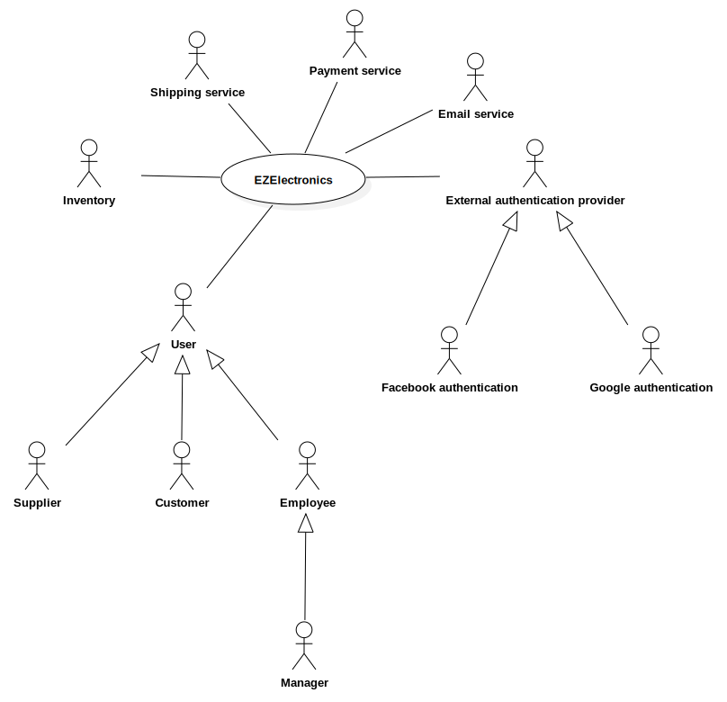

# Requirements Document - future EZElectronics

Date:

Version: V1 - description of EZElectronics in FUTURE form (as proposed by the team)

| Version number | Change |
| :------------: | :----: |
|                |        |

# Contents

- [Requirements Document - future EZElectronics](#requirements-document---future-ezelectronics)
- [Contents](#contents)
- [Informal description](#informal-description)
- [Stakeholders](#stakeholders)
- [Context Diagram and interfaces](#context-diagram-and-interfaces)
  - [Context Diagram](#context-diagram)
  - [Interfaces](#interfaces)
- [Stories and personas](#stories-and-personas)
- [Functional and non functional requirements](#functional-and-non-functional-requirements)
  - [Functional Requirements](#functional-requirements)
  - [Non Functional Requirements](#non-functional-requirements)
- [Use case diagram and use cases](#use-case-diagram-and-use-cases)
  - [Use case diagram](#use-case-diagram)
    - [Use case 1, UC1: User registration](#use-case-1-uc1-user-registration)
      - [Scenario 1.1](#scenario-11)
      - [Scenario 1.2](#scenario-12)
      - [Scenario 1.3](#scenario-13)
      - [Scenario 1.4](#scenario-14)
      - [Scenario 1.5](#scenario-15)
      - [Scenario 1.6](#scenario-16)
      - [Scenario 1.7](#scenario-17)
    - [Use case 2, UC2: User login](#use-case-2-uc2-user-login)
      - [Scenario 2.1](#scenario-21)
      - [Scenario 2.2](#scenario-22)
      - [Scenario 2.3](#scenario-23)
      - [Scenario 2.4](#scenario-24)
    - [Use case 3, UC3: Add a product](#use-case-3-uc3-add-a-product)
      - [Scenario 3.1](#scenario-31)
      - [Scenario 3.2](#scenario-32)
      - [Scenario 3.3](#scenario-33)
      - [Scenario 3.4](#scenario-34)
    - [Use case 4, UC4: Sell a product](#use-case-4-uc4-sell-a-product)
      - [Scenario 4.1](#scenario-41)
      - [Scenario 4.2](#scenario-42)
      - [Scenario 4.3](#scenario-43)
    - [Use case 5, UC5: Delete a product](#use-case-5-uc5-delete-a-product)
      - [Scenario 5.1](#scenario-51)
    - [Use case 6, UC6: Search for products](#use-case-6-uc6-search-for-products)
      - [Scenario 6.1](#scenario-61)
      - [Scenario 6.2](#scenario-62)
      - [Scenario 6.3](#scenario-63)
      - [Scenario 6.4](#scenario-64)
    - [Use case 7, UC7: Add product to cart](#use-case-7-uc7-add-product-to-cart)
      - [Scenario 7.1](#scenario-71)
      - [Scenario 7.2](#scenario-72)
    - [Use case 8, UC8: Remove a product from the cart](#use-case-8-uc8-remove-a-product-from-the-cart)
      - [Scenario 8.1](#scenario-81)
      - [Scenario 8.2](#scenario-82)
      - [Scenario 8.3](#scenario-83)
    - [Use case 9, UC9: Pay the current cart](#use-case-9-uc9-pay-the-current-cart)
      - [Scenario 9.1](#scenario-91)
      - [Scenario 9.2](#scenario-92)
      - [Scenario 9.3](#scenario-93)
      - [Scenario 9.4](#scenario-94)
    - [Use case 10, UC10: Return a product](#use-case-10-uc10-return-a-product)
      - [Scenario 10.1](#scenario-101)
      - [Scenario 10.2](#scenario-102)
    - [Use case 11, UC11: Accept returned product](#use-case-11-uc11-accept-returned-product)
      - [Scenario 11.1](#scenario-111)
      - [Scenario 11.2](#scenario-112)
    - [Use case 12, UC12: Edit a product](#use-case-12-uc12-edit-a-product)
      - [Scenario 12.1](#scenario-121)
      - [Scenario 12.2](#scenario-122)
    - [Use case 13, UC13: Change password](#use-case-13-uc13-change-password)
      - [Scenario 13.1](#scenario-131)
      - [Scenario 13.2](#scenario-132)
- [Glossary](#glossary)
- [Deployment Diagram](#deployment-diagram)

# Informal description

EZElectronics (read EaSy Electronics) is a software application designed to help managers of electronics stores to manage their products and offer them to customers through a dedicated website. Managers can assess the available products, record new ones, and confirm purchases. Customers can see available products, add them to a cart and see the history of their past purchases.

# Stakeholders

| Stakeholder name                   | Description                                                                        |
| :--------------------------------- | :--------------------------------------------------------------------------------- |
| Manager                            | Person that will manage the website and the orders                                 |
| Developer                          | Person that will develop the website                                               |
| Supplier                           | Person that will supply the goods sold on the website                              |
| Customer                           | Person that will buy products from the website                                     |
| Employee                           | Person who assists in managing the store, helps customers, and maintains inventory |
| Investor                           | Person that will invest money in the development of the website                    |
| Inventory                          | Entity that represents the stock of products in the store                          |
| Payment service                    | Third party service that will handle the payments on the website                   |
| Email service                      | Third party service that will handle the email sent by the backend                 |
| Google and Facebook authentication | Third party services that can be used in the authentication of the users           |
| Shipping service                   | Third party service that will handle the shipping of the products                  |

# Context Diagram and interfaces

## Context Diagram

## Interfaces

| Actor                   | Logical Interface                                                                                                      | Physical Interface       |
| :---------------------- | :--------------------------------------------------------------------------------------------------------------------- | :----------------------- |
| Manager                 | GUI (webapp)                                                                                                           | PC or Tablet             |
| Customer                | GUI (webapp)                                                                                                           | PC, Tablet or Smartphone |
| Inventory               | SQLite Database                                                                                                        | File on Filesystem       |
| Supplier                | GUI (webapp)                                                                                                           | PC, Tablet or Smartphone |
| Employee                | GUI (webapp)                                                                                                           | PC or Tablet             |
| Shipping service        | API ([docs](https://www.shippypro.com/ShippyPro-API-Documentation/?_gl=1*2zlkpx*_gcl_au*NDU1NDYyMDI2LjE3MTQ0MDA5OTE.)) | Internet                 |
| Payment service         | API ([docs](https://docs.stripe.com/))                                                                                 | Internet                 |
| Email service           | API ([docs](https://docs.aws.amazon.com/ses/latest/APIReference/Welcome.html))                                         | Internet                 |
| Google authentication   | API ([docs](https://developers.google.com/identity/gsi/web/guides/display-button?hl=it))                               | Internet                 |
| Facebook authentication | API ([docs](https://developers.facebook.com/docs/facebook-login/web))                                                  | Internet                 |

# Stories and personas

**Mario** is a manager of an electronics store. He uses the _EZElectronics_ website to manage the products in his store. He can order new products from a supplier, remove old ones, and set some product as sold. He can also see the history of the orders made by customers.

**Luigi** is a customer of an electronics store. He uses the _EZElectronics_ website to see the products available in the store. He can add products to his cart, see the history of his past purchases, and confirm an order.

**Guido** is a supplier of an electronics store. He uses the _EZElectronics_ website to register the products he delivered to the store. He can also see the list of products that an employee of the store has set to restock.

# Functional and non functional requirements

## Functional Requirements

| ID      | Description                                                          |
| :------ | :------------------------------------------------------------------- |
| FR1     | Authorization and Authentication                                     |
| FR1.1   | Login                                                                |
| FR1.1.1 | Login with username and password                                     |
| FR1.1.2 | Login with Google                                                    |
| FR1.1.3 | Login with Facebook                                                  |
| FR1.2   | Logout                                                               |
| FR1.3   | Logged in users shall be able to obtain their information            |
| FR1.4   | Users shall be able to reset their password if they forgot it        |
| FR1.5   | Users shall be able to change their password                         |
| FR2     | Manage Users                                                         |
| FR2.1   | Unregistered users shall be able to register themselves              |
| FR2.2   | Managers shall be able to list all the users                         |
| FR2.3   | Managers shall be able to create Employee and Supplier user accounts |
| FR3     | Manage Products                                                      |
| FR3.1   | Managers and Suppliers shall be able to add new products             |
| FR3.1.1 | Add a single new product                                             |
| FR3.1.2 | Add multiple new equal products (product with quantity > 1)          |
| FR3.2   | Managers shall be able to remove products                            |
| FR3.3   | Managers and Employees shall be able to set a product as sold        |
| FR3.4   | Logged in users shall be able to get product information             |
| FR3.5   | Logged in users shall be able to list products                       |
| FR3.5.1 | List product of a specific category                                  |
| FR3.5.2 | List product of a specific model                                     |
| FR3.5.3 | List all products                                                    |
| FR3.6   | Managers shall be able to delete a product                           |
| FR3.7   | Managers shall be able to edit a product                             |
| FR3.8   | Any user (logged or not logged in) shall be able to list products    |
| FR4     | Manage Carts                                                         |
| FR4.1   | Customers shall be able to list all products in their cart           |
| FR4.2   | Customers shall be able to add a product to their cart               |
| FR4.3   | Customers shall be able to remove a product from their cart          |
| FR4.4   | Customers shall be able to pay the cart                              |
| FR4.5   | Customers shall be able to list all carts that have been payed       |
| FR4.6   | Customers shall be able to delete the current cart                   |
| FR5     | Manage returned products                                             |
| FR5.1   | Managers and Employees shall be able to list all returned products   |
| FR5.2   | Managers and Employees shall be able to mark a product as returned   |
| FR5.3   | Customers shall be able to request a return of a product             |

## Non Functional Requirements

| ID   | Type        | Description                                                                                              | Refers to                  |
| :--- | :---------- | :------------------------------------------------------------------------------------------------------- | :------------------------- |
| NFR1 | Usability   | Customers shall be able to interact with the webapp with no training in less than 2 minutes              | All                        |
| NFR2 | Usability   | Managers shall be able to interact with the webapp with a training of 1 hour                             | FR3.1, FR3.2, FR3.3, FR3.6 |
| NFR3 | Efficiency  | All functions must complete in < 0.5 s                                                                   | All                        |
| NFR4 | Reliability | No more than 1 defect per year per user                                                                  | All                        |
| NFR5 | Portability | The API server must be connected to the Internet with a connection of at least 1Gb/s                     | All                        |
| NFR6 | Portability | The webapp must be accessible from >99% devices with a browser                                           | All                        |
| NFR7 | Security    | User passwords should meet at least basic security standards                                             | FR1.4, FR2.1               |
| NFR8 | Usability   | Customers shall be able to insert a product in the cart and pay for it with no more than 15 interactions | FR4.2, FR4.4               |

# Use case diagram and use cases

## Use case diagram

### Use case 1, UC1: User registration

| Actors Involved  | Customer, Manager, Employee, Supplier                           |
| :--------------- | :-------------------------------------------------------------- |
| Precondition     | The user is not registered                                      |
| Post condition   | The user is registered and able to login                        |
| Nominal Scenario | [Scenario 1.1: Customer registration](#scenario-11)             |
| Variants         | [Scenario 1.2: External provider](#scenario-12)                 |
| Exceptions       | [Scenario 1.3: User already registered](#scenario-13)           |
|                  | [Scenario 1.4: Passwords don't match](#scenario-14)             |
|                  | [Scenario 1.5: Invalid data](#scenario-15)                      |
|                  | [Scenario 1.6: External provider fails](#scenario-16)           |
|                  | [Scenario 1.7: Manager creates Employee/Supplier](#scenario-17) |

#### Scenario 1.1

Customer registers successfully

| Scenario 1.1   |                                           |
| :------------- | :---------------------------------------- |
| Precondition   | Customer is not registered                |
| Post condition | Customer is registered and able to login  |
| **Step#**      | **Description**                           |
| 1              | Customer asks for registration            |
| 2              | Customer fills in the required data       |
| 3              | Customer confirms                         |
| 4              | System calls the API to register the user |
| 5              | System returns a confirmation message     |

#### Scenario 1.2

Customer uses an external authentication provider

| Scenario 1.2   |                                                          |
| :------------- | :------------------------------------------------------- |
| Precondition   | User is not registered                                   |
| Post condition | User is registered and able to login                     |
| **Step#**      | **Description**                                          |
| 1              | User asks for registration                               |
| 2              | User selects the external provider                       |
| 3              | User goes to the external provider authentication system |
| 4              | External provider calls the API to register the user     |
| 5              | System returns a confirmation message                    |

#### Scenario 1.3

User is already registered

| Scenario 1.3   |                                           |
| :------------- | :---------------------------------------- |
| Precondition   | User is not registered                    |
| Post condition | User is not registered                    |
| **Step#**      | **Description**                           |
| 1              | User asks for registration                |
| 2              | User fills in the required data           |
| 3              | User confirms                             |
| 4              | System calls the API to register the user |
| 5              | System returns an error message           |
| 6              | An error message is shown to the user     |
| 7              | Go to _Step 2_                            |

#### Scenario 1.4

Fields _Password_ and _Verify Password_ don't match

| Scenario 1.4   |                                       |
| :------------- | :------------------------------------ |
| Precondition   | User is not registered                |
| Post condition | -                                     |
| **Step#**      | **Description**                       |
| 1              | User asks for registration            |
| 2              | User fills in the required data       |
| 3              | User confirms                         |
| 4              | An error message is shown to the user |
| 5              | Go to _Step 2_                        |

#### Scenario 1.5

Invalid data

| Scenario 1.5   |                                           |
| :------------- | :---------------------------------------- |
| Precondition   | User is not registered                    |
| Post condition | -                                         |
| **Step#**      | **Description**                           |
| 1              | User asks for registration                |
| 2              | User fills in the required data           |
| 3              | User confirms                             |
| 4              | System calls the API to register the user |
| 5              | System returns an error message           |
| 6              | An error message is shown to the user     |
| 7              | Go to _Step 2_                            |

#### Scenario 1.6

External provider fails to authenticate the user

| Scenario 1.6   |                                                          |
| :------------- | :------------------------------------------------------- |
| Precondition   | User is not registered                                   |
| Post condition | User is not registered                                   |
| **Step#**      | **Description**                                          |
| 1              | User asks for registration                               |
| 2              | User selects the external provider                       |
| 3              | User goes to the external provider authentication system |
| 4              | External provider fails to authenticate the user         |
| 5              | An error message is shown to the user                    |
| 6              | Go to _Step 2_                                           |

#### Scenario 1.7

Manager creates Employee or Supplier account

| Scenario 1.7   |                                                                        |
| :------------- | :--------------------------------------------------------------------- |
| Precondition   | Manager is logged in                                                   |
| Post condition | Employee or Supplier account is created                                |
| **Step#**      | **Description**                                                        |
| 1              | Manager asks to register a new Employee or Supplier                    |
| 2              | Manager fills in the required data                                     |
| 3              | Manager confirms                                                       |
| 4              | System calls the API to register the user                              |
| 5              | System sends an email to the new user with reset password instructions |
| 6              | System returns a confirmation message                                  |

### Use case 2, UC2: User login

| Actors Involved  | Customer, Manager, Employee, Supplier                          |
| :--------------- | :------------------------------------------------------------- |
| Precondition     | The user is not authenticated                                  |
| Post condition   | The user is authenticated                                      |
| Nominal Scenario | [Scenario 2.1: User logs in successfully](#scenario-21)        |
| Variants         | [Scenario 2.4: External authentication provider](#scenario-24) |
| Exceptions       | [Scenario 2.2: Wrong username or password](#scenario-22)       |
|                  | [Scenario 2.3: Forgot password](#scenario-23)                  |

#### Scenario 2.1

User logs in successfully

| Scenario 2.1   |                                       |
| :------------- | :------------------------------------ |
| Precondition   | User is not authenicated              |
| Post condition | User is authenticated                 |
| **Step#**      | **Description**                       |
| 1              | User asks for login                   |
| 2              | User fills in the username            |
| 3              | User fills in the password            |
| 4              | User confirms                         |
| 5              | System calls the API to login         |
| 6              | System returns a confirmation message |

#### Scenario 2.2

User inserts a wrong username or password

| Scenario 2.2   |                                         |
| :------------- | :-------------------------------------- |
| Precondition   | User is not authenicated                |
| Post condition | User is not authenticated               |
| **Step#**      | **Description**                         |
| 1              | User asks for login                     |
| 2              | User fills in the username              |
| 3              | User fills in the password              |
| 4              | User confirms                           |
| 5              | System calls the API to login           |
| 6              | System returns an error message         |
| 7              | Go to _Step 2_ if low number of retries |
| 8              | System locks the user account           |

#### Scenario 2.3

Forgot password

| Scenario 2.3   |                                                        |
| :------------- | :----------------------------------------------------- |
| Precondition   | User is registered but not logged in                   |
| Post condition | User is sent an email with reset password instructions |
| **Step#**      | **Description**                                        |
| 1              | User asks for login                                    |
| 2              | User clicks on the "forgot password" link              |
| 3              | User fills in the email                                |
| 4              | User confirms                                          |
| 5              | System calls the API for resetting the password        |
| 6              | System sends an email with reset password instructions |
| 7              | A confirmation message is shown to the user            |

#### Scenario 2.4

User logs in with an external provider

| Scenario 2.4   |                                                          |
| :------------- | :------------------------------------------------------- |
| Precondition   | User is not authenticated                                |
| Post condition | User is authenticated                                    |
| **Step#**      | **Description**                                          |
| 1              | User asks for login                                      |
| 2              | User selects an external provider                        |
| 3              | User goes to the external provider authentication system |
| 4              | External provider calls the API to login                 |
| 5              | System returns a confirmation message                    |

### Use case 3, UC3: Add a product

| Actors Involved  | Manager, Supplier                                                    |
| :--------------- | :------------------------------------------------------------------- |
| Precondition     | Manager or Supplier is authenticated                                 |
| Post condition   | Product is added                                                     |
| Nominal Scenario | [Scenario 3.1: add a single product](#scenario-31)                   |
| Variants         | [Scenario 3.2: add multiple products](#scenario-32)                  |
| Exceptions       | [Scenario 3.3: code already present](#scenario-33)                   |
|                  | [Scenario 3.4: arrival date is after the current date](#scenario-34) |

#### Scenario 3.1

Manager or Supplier adds a product successfully

| Scenario 3.1   |                                                      |
| :------------- | :--------------------------------------------------- |
| Precondition   | Manager or Supplier is authenticated                 |
| Post condition | Product is added                                     |
| **Step#**      | **Description**                                      |
| 1              | Manager or Supplier goes on the inventory management |
| 2              | Manager or Supplier fills in required data           |
| 3              | Manager or Supplier confirms                         |
| 4              | System calls the API to insert the product           |
| 5              | System returns a confirmation message                |

#### Scenario 3.2

Manager or Supplier adds multiple products successfully

| Scenario 3.2   |                                                      |
| :------------- | :--------------------------------------------------- |
| Precondition   | Manager or Supplier is authenticated                 |
| Post condition | Multiple products are added                          |
| **Step#**      | **Description**                                      |
| 1              | Manager or Supplier goes on the inventory management |
| 2              | Manager or Supplier fills in required data           |
| 3              | Manager or Supplier confirms                         |
| 4              | System calls the API to insert multiple products     |
| 5              | System returns a confirmation message                |

#### Scenario 3.3

Product code is already present on the system

| Scenario 3.3   |                                                      |
| :------------- | :--------------------------------------------------- |
| Precondition   | Manager or Supplier is authenticated                 |
| Post condition | Product is not added                                 |
| **Step#**      | **Description**                                      |
| 1              | Manager or Supplier goes on the inventory management |
| 2              | Manager or Supplier fills in required data           |
| 3              | Manager or Supplier confirms                         |
| 4              | System calls the API to insert the product           |
| 5              | System returns an error message                      |
| 6              | Go to _Step 2_                                       |

#### Scenario 3.4

Arrival date is after the current date

| Scenario 3.4   |                                                      |
| :------------- | :--------------------------------------------------- |
| Precondition   | Manager or Supplier is authenticated                 |
| Post condition | Product is not added                                 |
| **Step#**      | **Description**                                      |
| 1              | Manager or Supplier goes on the inventory management |
| 2              | Manager or Supplier fills in required data           |
| 3              | Manager or Supplier confirms                         |
| 4              | System calls the API to insert the product           |
| 5              | System returns an error message                      |
| 6              | Go to _Step 2_                                       |

### Use case 4, UC4: Sell a product

| Actors Involved  | Manager, Employee                                       |
| :--------------- | :------------------------------------------------------ |
| Precondition     | Manager or Employee is authenticated and product exists |
| Post condition   | Product is marked as sold                               |
| Nominal Scenario | [Scenario 4.1: Product marked as sold](#scenario-41)    |
| Variants         | -                                                       |
| Exceptions       | [Scenario 4.2: Invalid selling date](#scenario-42)      |
|                  | [Scenario 4.3: Product already sold](#scenario-43)      |

#### Scenario 4.1

Product is sold correctly in the shop

| Scenario 4.1   |                                                            |
| :------------- | :--------------------------------------------------------- |
| Precondition   | Manager or Employee is authenticated and product exists    |
| Post condition | Product is marked as sold                                  |
| **Step#**      | **Description**                                            |
| 1              | Manager or Employee goes on the inventory management       |
| 2              | Manager or Employee selects the product that wants to sell |
| 3              | Manager or Employee inserts the selling date               |
| 4              | Manager or Employee sets the product as sold               |
| 5              | System calls the API to mark the product as sold           |
| 6              | System returns a confirmation message                      |

#### Scenario 4.2

Selling date is not valid (because it is on the future or before the arrival date of the product)

| Scenario 4.2   |                                                            |
| :------------- | :--------------------------------------------------------- |
| Precondition   | Manager or Employee is authenticated and product exists    |
| Post condition | Product unchanged                                          |
| **Step#**      | **Description**                                            |
| 1              | Manager or Employee goes on the inventory management       |
| 2              | Manager or Employee selects the product that wants to sell |
| 3              | Manager or Employee inserts the selling date               |
| 4              | Manager or Employee sets the product as sold               |
| 5              | System calls the API to mark the product as sold           |
| 6              | System returns an error message                            |
| 7              | Go to _Step 3_                                             |

#### Scenario 4.3

Product is already sold

| Scenario 4.3   |                                                            |
| :------------- | :--------------------------------------------------------- |
| Precondition   | Manager or Employee is authenticated and product exists    |
| Post condition | Product unchanged                                          |
| **Step#**      | **Description**                                            |
| 1              | Manager or Employee goes on the inventory management       |
| 2              | Manager or Employee selects the product that wants to sell |
| 3              | Manager or Employee inserts the selling date               |
| 4              | Manager or Employee sets the product as sold               |
| 5              | System calls the API to mark the product as sold           |
| 6              | System returns an error message                            |
| 7              | Go to _Step 3_                                             |

### Use case 5, UC5: Delete a product

| Actors Involved  | Manager                                       |
| :--------------- | :-------------------------------------------- |
| Precondition     | Manager is authenticated and product exists   |
| Post condition   | Product is deleted                            |
| Nominal Scenario | [Scenario 5.1: Product deleted](#scenario-51) |
| Variants         | -                                             |
| Exceptions       | -                                             |

#### Scenario 5.1

Product is deleted correctly

| Scenario 5.1   |                                                  |
| :------------- | :----------------------------------------------- |
| Precondition   | Manager is authenticated and product exists      |
| Post condition | Product is deleted                               |
| **Step#**      | **Description**                                  |
| 1              | Manager goes on the inventory management         |
| 2              | Manager selects the product that wants to delete |
| 3              | Manager confirms                                 |
| 4              | System calls the API to delete the product       |
| 5              | System returns a confirmation message            |

### Use case 6, UC6: Search for products

| Actors Involved  | Customer, Manager                                         |
| :--------------- | :-------------------------------------------------------- |
| Precondition     | User is authenticated                                     |
| Post condition   | Products are shown to the user                            |
| Nominal Scenario | [Scenario 6.1: List all products](#scenario-61)           |
| Variants         | [Scenario 6.2: List products of a category](#scenario-62) |
|                  | [Scenario 6.3: List products of a model](#scenario-63)    |
|                  | [Scenario 6.4: Get product information](#scenario-64)     |
| Exceptions       | -                                                         |

#### Scenario 6.1

All products are shown to the user

| Scenario 6.1   |                                               |
| :------------- | :-------------------------------------------- |
| Precondition   | User is authenticated                         |
| Post condition | Products are shown to the user                |
| **Step#**      | **Description**                               |
| 1              | User goes to the product list                 |
| 2              | System calls the API to list all the products |
| 3              | Products are shown to the user                |

#### Scenario 6.2

All products in a given category are shown to the user

| Scenario 6.2   |                                                       |
| :------------- | :---------------------------------------------------- |
| Precondition   | User is authenticated and the category exists         |
| Post condition | Products of the category are shown to the user        |
| **Step#**      | **Description**                                       |
| 1              | User selects a category                               |
| 2              | System calls the API to list products of the category |
| 3              | Products of the category are shown to the user        |

#### Scenario 6.3

All products of a given model are shown to the user

| Scenario 6.3   |                                                |
| :------------- | :--------------------------------------------- |
| Precondition   | User is authenticated and the model exists     |
| Post condition | Products of the model is shown to the user     |
| **Step#**      | **Description**                                |
| 1              | User selects a category                        |
| 2              | System calls the API to list products of model |
| 3              | Products of the model are shown to the user    |

#### Scenario 6.4

Specific product is shown to the user

| Scenario 6.4   |                                              |
| :------------- | :------------------------------------------- |
| Precondition   | User is authenticated and the product exists |
| Post condition | Product is shown to the user                 |
| **Step#**      | **Description**                              |
| 1              | User selects a product                       |
| 2              | System calls the API to get product details  |
| 3              | Product is shown to the user                 |

### Use case 7, UC7: Add product to cart

| Actors Involved  | Customer                                                |
| :--------------- | :------------------------------------------------------ |
| Precondition     | Customer is authenticated                               |
| Post condition   | Product is added to the cart                            |
| Nominal Scenario | [Scenario 7.1: product added to the cart](#scenario-71) |
| Variants         | -                                                       |
| Exceptions       | [Scanario 7.2: product not available](#scenario-72)     |

#### Scenario 7.1

Product is added to the cart

| Scenario 7.1   |                                                     |
| :------------- | :-------------------------------------------------- |
| Precondition   | Customer is authenticated                           |
| Post condition | Product is added to the cart                        |
| **Step#**      | **Description**                                     |
| 1              | Customer adds a product to the cart                 |
| 2              | System calls the API to add the product to the cart |
| 3              | System returns a confirmation message               |
| 4              | A confirmation message is shown to the user         |

#### Scenario 7.2

Product is not available because it is already in another cart or is already sold

| Scenario 7.2   |                                                     |
| :------------- | :-------------------------------------------------- |
| Precondition   | Customer is authenticated                           |
| Post condition | Product is not added to the cart                    |
| **Step#**      | **Description**                                     |
| 1              | Customer adds a product to the cart                 |
| 2              | System calls the API to add the product to the cart |
| 3              | System returns an error message                     |
| 4              | An error message is shown to the user               |

### Use case 8, UC8: Remove a product from the cart

| Actors Involved  | Customer                                               |
| :--------------- | :----------------------------------------------------- |
| Precondition     | Customer is authenticated and has products in the cart |
| Post condition   | Product is removed from the cart                       |
| Nominal Scenario | [Scenario 8.1: remove a product](#scenario-81)         |
| Variants         | [Scenario 8.2: empty the cart](#scenario-82)           |
| Exceptions       | [Scenario 8.3: invalid data](#scenario-83)             |

#### Scenario 8.1

Product is removed from the cart

| Scenario 8.1   |                                                          |
| :------------- | :------------------------------------------------------- |
| Precondition   | Customer is authenticated and the product is in the cart |
| Post condition | Product is removed from the cart                         |
| **Step#**      | **Description**                                          |
| 1              | Customer removes a product to the cart                   |
| 2              | System calls the API to remove the product to the cart   |
| 3              | System returns a confirmation message                    |
| 4              | A confirmation message is shown to the user              |

#### Scenario 8.2

Customer empties the cart

| Scenario 8.2   |                                                        |
| :------------- | :----------------------------------------------------- |
| Precondition   | Customer is authenticated and products are in the cart |
| Post condition | All products are removed from the cart                 |
| **Step#**      | **Description**                                        |
| 1              | Customer empties the cart                              |
| 2              | System calls the API to remove the current cart        |
| 3              | System returns a confirmation message                  |
| 4              | A confirmation message is shown to the user            |

#### Scenario 8.3

The product customer wants to remove is not in the cart, the code of the product is not valid, or customer has no cart

| Scenario 8.3   |                                                        |
| :------------- | :----------------------------------------------------- |
| Precondition   | Customer is authenticated                              |
| Post condition | Product is not removed                                 |
| **Step#**      | **Description**                                        |
| 1              | Customer removes a product from the cart               |
| 2              | System calls the API to remove the product to the cart |
| 3              | System returns an error message                        |
| 4              | An error message is shown to the user                  |

### Use case 9, UC9: Pay the current cart

| Actors Involved  | Customer                                               |
| :--------------- | :----------------------------------------------------- |
| Precondition     | Customer is authenticated and has products in the cart |
| Post condition   | Cart is marked as paid                                 |
| Nominal Scenario | [Scenario 9.1: cart paid](#scenario-91)                |
| Variants         | -                                                      |
| Exceptions       | [Scenario 9.2: empty cart](#scenario-92)               |
|                  | [Scenario 9.3: payment service error](#scenario-93)    |
|                  | [Scenario 9.4: shipment service error](#scenario-94)   |

#### Scenario 9.1

The cart is correctly marked as paid

| Scenario 9.1   |                                                            |
| :------------- | :--------------------------------------------------------- |
| Precondition   | Customer is authenticated and has products in the cart     |
| Post condition | Cart is marked as paid                                     |
| **Step#**      | **Description**                                            |
| 1              | Customer tries to pay the cart                             |
| 2              | System calls the API to set the cart as paid               |
| 3              | System calls the payment service API to handle the payment |
| 4              | Customer inserts payment method details                    |
| 5              | The payment service returns a confirmation message         |
| 6              | User inserts shipment information                          |
| 7              | Shipment service API is called                             |
| 8              | Shipment service returns a confirmation message            |
| 9              | A confirmation message is shown to the customer            |
| 10             | An email is sent to the customer with the order details    |

#### Scenario 9.2

The cart is empty or the cart does not exists

| Scenario 9.2   |                                                                             |
| :------------- | :-------------------------------------------------------------------------- |
| Precondition   | Customer is authenticated and the cart is empty or the cart does not exists |
| Post condition | Nothing changes                                                             |
| **Step#**      | **Description**                                                             |
| 1              | Customer tries to pay the cart                                              |
| 2              | System calls the API to set the cart as paid                                |
| 3              | System returns an error message                                             |
| 4              | An error message is shown to the user                                       |

#### Scenario 9.3

Payment service returns an error message

| Scenario 9.3   |                                                            |
| :------------- | :--------------------------------------------------------- |
| Precondition   | Customer is authenticated and has products in the cart     |
| Post condition | Nothing changes                                            |
| **Step#**      | **Description**                                            |
| 1              | Customer tries to pay the cart                             |
| 2              | System calls the API to set the cart as paid               |
| 3              | System calls the payment service API to handle the payment |
| 4              | Customer inserts payment method details                    |
| 5              | The payment service returns an error message               |
| 6              | An error message is shown to the user                      |

#### Scenario 9.4

Shipment service returns an error message

| Scenario 9.4   |                                                            |
| :------------- | :--------------------------------------------------------- |
| Precondition   | Customer is authenticated and has products in the cart     |
| Post condition | Nothing changes                                            |
| **Step#**      | **Description**                                            |
| 1              | Customer tries to pay the cart                             |
| 2              | System calls the API to set the cart as paid               |
| 3              | System calls the payment service API to handle the payment |
| 4              | Customer inserts payment method details                    |
| 5              | The payment service returns a confirmation message         |
| 6              | User inserts shipment information                          |
| 7              | Shipment service API is called                             |
| 8              | Shipment service returns an error message                  |
| 9              | An error message is shown to the user                      |

### Use case 10, UC10: Return a product

| Actors Involved  | Customer                                         |
| :--------------- | :----------------------------------------------- |
| Precondition     | Customer is authenticated and has paid a product |
| Post condition   | Product is marked as "willing to return"         |
| Nominal Scenario | [Scenario 10.1: product returned](#scenario-101) |
| Variants         | -                                                |
| Exceptions       | [Scenario 10.2: product not paid](#scenario-102) |

#### Scenario 10.1

The product is marked as "willing to return"

| Scenario 10.1  |                                                  |
| :------------- | :----------------------------------------------- |
| Precondition   | Customer is authenticated and has paid a product |
| Post condition | Product is marked as "willing to return"         |
| **Step#**      | **Description**                                  |
| 1              | Customer selects a product he has paid           |
| 2              | Customer asks to return that product             |
| 3              | System calls the API to return a product         |
| 4              | A confirmation message is shown to the user      |

#### Scenario 10.2

The product is not in the list of products the customer has paid

| Scenario 10.2  |                                                  |
| :------------- | :----------------------------------------------- |
| Precondition   | Customer is authenticated and has paid a product |
| Post condition | Product is not marked as "willing to return"     |
| **Step#**      | **Description**                                  |
| 1              | Customer selects a product he has not paid       |
| 2              | Customer asks to return that product             |
| 3              | System calls the API to return a product         |
| 4              | An error message is shown to the user            |

### Use case 11, UC11: Accept returned product

| Actors Involved  | Manager, Employee                                                                              |
| :--------------- | :--------------------------------------------------------------------------------------------- |
| Precondition     | Manager or Employee is authenticated and at least one product is marked as "willing to return" |
| Post condition   | Product is marked as "returned" and the customer is refunded                                   |
| Nominal Scenario | [Scenario 11.1: customer refunded](#scenario-111)                                              |
| Variants         | -                                                                                              |
| Exceptions       | [Scenario 11.2: product not to return](#scenario-112)                                          |

#### Scenario 11.1

The product is marked as "returned" and the customer is refunded

| Scenario 11.1  |                                                                                     |
| :------------- | :---------------------------------------------------------------------------------- |
| Precondition   | Manager or Employee is authenticated and a product is marked as "willing to return" |
| Post condition | Product is marked as "returned" and the customer is refunded                        |
| **Step#**      | **Description**                                                                     |
| 1              | Manager or Employee goes on the list of products marked as "willing to return"      |
| 2              | Manager or Employee selects the product that has to be returned                     |
| 3              | Manager or Employee confirms the return                                             |
| 4              | System calls the API to mark the product as "returned"                              |
| 5              | System refunds the Customer                                                         |
| 6              | An email is sent to the Customer                                                    |
| 7              | A confirmation message is shown to the user                                         |

#### Scenario 11.2

The product is not in the list of products marked as "willing to return"

| Scenario 11.2  |                                                                                                         |
| :------------- | :------------------------------------------------------------------------------------------------------ |
| Precondition   | Manager or Employee is authenticated and at least one product is marked as "willing to return"          |
| Post condition | Product is not marked as "returned" and the customer is not refunded                                    |
| **Step#**      | **Description**                                                                                         |
| 1              | Manager or Employee selects a product that is not in the list of products marked as "willing to return" |
| 2              | Manager or Employee confirms the return                                                                 |
| 3              | System calls the API to mark the product as "returned"                                                  |
| 4              | An error message is shown to the user                                                                   |

### Use case 12, UC12: Edit a product

| Actors Involved  | Manager                                        |
| :--------------- | :--------------------------------------------- |
| Precondition     | Manager is authenticated and product exists    |
| Post condition   | Product is edited                              |
| Nominal Scenario | [Scenario 12.1: product edited](#scenario-121) |
| Variants         | -                                              |
| Exceptions       | [Scenario 12.2: invalid data](#scenario-122)   |

#### Scenario 12.1

The product is edited correctly

| Scenario 12.1  |                                              |
| :------------- | :------------------------------------------- |
| Precondition   | Manager is authenticated and product exists  |
| Post condition | Product is edited                            |
| **Step#**      | **Description**                              |
| 1              | Manager goes on the inventory management     |
| 2              | Manager selects the product he wants to edit |
| 3              | Manager edits the product                    |
| 4              | System calls the API to edit the product     |
| 5              | A confirmation message is shown to the user  |

#### Scenario 12.2

The inserted data is invalid

| Scenario 12.2  |                                              |
| :------------- | :------------------------------------------- |
| Precondition   | Manager is authenticated and product exists  |
| Post condition | Product is not edited                        |
| **Step#**      | **Description**                              |
| 1              | Manager goes on the inventory management     |
| 2              | Manager selects the product he wants to edit |
| 3              | Manager edits the product with invalid data  |
| 4              | System calls the API to edit the product     |
| 5              | An error message is shown to the user        |

### Use case 13, UC13: Change password

| Actors Involved  | Customer, Manager, Employee, Supplier            |
| :--------------- | :----------------------------------------------- |
| Precondition     | User is authenticated                            |
| Post condition   | Password is changed                              |
| Nominal Scenario | [Scenario 13.1: password changed](#scenario-131) |
| Variants         | -                                                |
| Exceptions       | [Scenario 13.2: invalid password](#scenario-132) |

#### Scenario 13.1

The password is changed correctly

| Scenario 13.1  |                                             |
| :------------- | :------------------------------------------ |
| Precondition   | User is authenticated                       |
| Post condition | Password is changed                         |
| **Step#**      | **Description**                             |
| 1              | User asks to change password                |
| 2              | User inserts the old password               |
| 3              | User inserts the new password               |
| 4              | User confirms                               |
| 5              | System calls the API to change the password |
| 6              | A confirmation message is shown to the user |

#### Scenario 13.2

The new password is invalid

| Scenario 13.2  |                                             |
| :------------- | :------------------------------------------ |
| Precondition   | User is authenticated                       |
| Post condition | Password is not changed                     |
| **Step#**      | **Description**                             |
| 1              | User asks to change password                |
| 2              | User inserts the old password               |
| 3              | User inserts the new password               |
| 4              | User confirms                               |
| 5              | System calls the API to change the password |
| 6              | An error message is shown to the user       |

# Glossary

# Deployment Diagram

