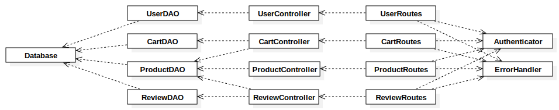

# Test Report

<The goal of this document is to explain how the application was tested, detailing how the test cases were defined and what they cover>

## Contents

- [Test Report](#test-report)
  - [Contents](#contents)
  - [Dependency graph](#dependency-graph)
  - [Integration approach](#integration-approach)
  - [Tests](#tests)
    - [Unit tests: White Box](#unit-tests-white-box)
      - [DAO modules](#dao-modules)
      - [Controllers](#controllers)
      - [Routes](#routes)
    - [Integration tests: Black Box](#integration-tests-black-box)
  - [Coverage](#coverage)
    - [Coverage of FR and UC](#coverage-of-fr-and-uc)
    - [Coverage white box](#coverage-white-box)

## Dependency graph

## Integration approach

Tests are organized in three principal categories and are performed using the Jest testing framework.
The three categories are:

- **Unit tests**: These tests are used to test the smallest units of the application, such as functions, classes, or modules. They are used to ensure that each unit of the software performs as designed. For each module, dependencies are mocked.
  - firstly DAO modules are tested, which depends only on the database. These modules are `UserDAO`, `CartDAO`, `ProductDAO` and `ReviewDAO`
  - the second step is to test the controllers, whose role is to perform the logic of the application. These modules are `UserController`, `CartController`, `ProductController` and `ReviewController`. They depends on the DAO modules.
  - finally, the Routes are tested. These modules are `UserRoutes`, `CartRoutes`, `ProductRoutes` and `ReviewRoutes`. They depends on the controllers, `Authenticator`, and `ErrorHandler`
- **Integration tests**: These tests are used to test the integration between different units of the application. They are used to ensure that the different units of the software work together as expected.
  - the integration tests are performed on the routes, which are the entry points of the application.For each route the output in the database is checked, so that the entire flow (from the API call to the DB) is tested.
- **Acceptance tests**: These tests are used to test the application as a whole. They are used to ensure that the application meets the requirements of the user.
  - the acceptance tests are performed on the API. These test are written by the committee (course managers)

## Tests

### Unit tests: White Box

#### DAO modules

|    Module    | Function                         | Test cases                                     |       Technique used        |
| :----------: | :------------------------------- | :--------------------------------------------- | :-------------------------: |
|  `UserDAO`   | `createUser`                     | USER -> test createUser method                 | Multiple condition coverage |
|  `UserDAO`   | `getUserByUsername`              | USER -> test getUserByUsername method          | Multiple condition coverage |
|  `UserDAO`   | `getUsers`                       | USER -> test getUsers method                   | Multiple condition coverage |
|  `UserDAO`   | `deleteUser`                     | USER -> test deleteUser method                 | Multiple condition coverage |
|  `UserDAO`   | `deleteAll`                      | USER -> test deleteAll method                  | Multiple condition coverage |
|  `UserDAO`   | `updateUser`                     | USER -> test updateUser method                 | Multiple condition coverage |
|  `UserDAO`   | `getIsUserAuthenticated`         | USER -> test getIsUserAuthenticated method     |  Simple condition coverage  |
| `ProductDAO` | `registerProduct`                | PRODUCT -> test registerProduct                | Multiple condition coverage |
| `ProductDAO` | `changeProductQuantity`          | PRODUCT -> test changeProductQuantity          | Multiple condition coverage |
| `ProductDAO` | `getProduct`                     | PRODUCT -> test getProduct                     | Multiple condition coverage |
| `ProductDAO` | `getProducts`                    | PRODUCT -> test getProducts                    | Multiple condition coverage |
| `ProductDAO` | `getProductsByCategory`          | PRODUCT -> test getProductsByCategory          | Multiple condition coverage |
| `ProductDAO` | `getAvailableProductsByCategory` | PRODUCT -> test getAvailableProductsByCategory | Multiple condition coverage |
| `ProductDAO` | `getProductAvailable`            | PRODUCT -> test getProductAvailable            | Multiple condition coverage |
| `ProductDAO` | `getAvailableProducts`           | PRODUCT -> test getAvailableProducts           | Multiple condition coverage |
| `ProductDAO` | `deleteAllProducts`              | PRODUCT -> test deleteAllProducts              | Multiple condition coverage |
| `ProductDAO` | `deleteProduct`                  | PRODUCT -> test deleteProduct                  | Multiple condition coverage |
|  `CartDAO`   | `getCurrentCart`                 | CART -> getCurrentCart                         | Multiple condition coverage |
|  `CartDAO`   | `getProductsByCartId`            | CART -> getProductsByCartId                    | Multiple condition coverage |
|  `CartDAO`   | `incrementProductInCart`         | CART -> incrementProductInCart                 | Multiple condition coverage |
|  `CartDAO`   | `insertProductInCart`            | CART -> insertProductInCart                    | Multiple condition coverage |
|  `CartDAO`   | `createCart`                     | CART -> createCart                             | Multiple condition coverage |
|  `CartDAO`   | `updateCartTotal`                | CART -> updateCartTotal                        | Multiple condition coverage |
|  `CartDAO`   | `checkoutCart`                   | CART -> checkoutCart                           | Multiple condition coverage |
|  `CartDAO`   | `getCustomerCarts`               | CART -> getCustomerCarts                       | Multiple condition coverage |
|  `CartDAO`   | `deleteProductFromCart`          | CART -> deleteProductFromCart                  | Multiple condition coverage |
|  `CartDAO`   | `clearCart`                      | CART -> clearCart                              | Multiple condition coverage |
|  `CartDAO`   | `deleteAllCarts`                 | CART -> deleteAllCarts                         | Multiple condition coverage |
|  `CartDAO`   | `deleteAllCarts`                 | CART -> deleteAllCarts                         | Multiple condition coverage |
| `ReviewDAO`  | `existingReview`                 | REVIEW -> ReviewDAO.existingReview             | Multiple condition coverage |
| `ReviewDAO`  | `getProductReviews`              | REVIEW -> ReviewDAO.getProductReviews          | Multiple condition coverage |
| `ReviewDAO`  | `addReview`                      | REVIEW -> ReviewDAO.addReview                  | Multiple condition coverage |
| `ReviewDAO`  | `deleteReview`                   | REVIEW -> ReviewDAO.deleteReview               | Multiple condition coverage |
| `ReviewDAO`  | `deleteReviewsOfProduct`         | REVIEW -> ReviewDAO.deleteReviewsOfProduct     | Multiple condition coverage |
| `ReviewDAO`  | `deleteAllReviews`               | REVIEW -> ReviewDAO.deleteAllReviews           | Multiple condition coverage |

#### Controllers

|       Module        | Function                         | Test cases                                        |       Technique used        |
| :-----------------: | :------------------------------- | :------------------------------------------------ | :-------------------------: |
|  `UserController`   | `createUser`                     | USER -> test createUser                           |     Statement coverage      |
|  `UserController`   | `getUsers`                       | USER -> test getUsers                             |     Statement coverage      |
|  `UserController`   | `getUsersByRole`                 | USER -> test getUsersByRole                       |     Statement coverage      |
|  `UserController`   | `getUserByUsername`              | USER -> test getUserByUsername                    | Multiple condition coverage |
|  `UserController`   | `deleteUser`                     | USER -> test deleteUser                           | Multiple condition coverage |
|  `UserController`   | `deleteAll`                      | USER -> test deleteAll                            |     Statement coverage      |
|  `UserController`   | `updateUserInfo`                 | USER -> test updateUserInfo                       | Multiple condition coverage |
| `ProductController` | `registerProduct`                | PRODUCT -> test registerProduct                   | Multiple condition coverage |
| `ProductController` | `changeProductQuantity`          | PRODUCT -> test changeProductQuantity             | Multiple condition coverage |
| `ProductController` | `sellProduct`                    | PRODUCT -> test sellProduct                       | Multiple condition coverage |
| `ProductController` | `getProducts`                    | PRODUCT -> test getProducts                       | Multiple condition coverage |
| `ProductController` | `getAvailableProducts`           | PRODUCT -> test getAvailableProducts              | Multiple condition coverage |
| `ProductController` | `deleteAllProducts`              | PRODUCT -> test deleteAllProducts                 |     Statement coverage      |
| `ProductController` | `deleteProduct`                  | PRODUCT -> test deleteProduct                     |     Statement coverage      |
|  `CartController`   | `addToCart`                      | CART -> addToCart                                 | Multiple condition coverage |
|  `CartController`   | `getCart`                        | CART -> getCart                                   |     Statement coverage      |
|  `CartController`   | `checkoutCart`                   | CART -> checkoutCart                              | Multiple condition coverage |
|  `CartController`   | `checkProductAvailabilityOfCart` | CART -> checkProductAvailabilityOfCart            | Multiple condition coverage |
|  `CartController`   | `getCustomerCarts`               | CART -> getCustomerCarts                          |     Statement coverage      |
|  `CartController`   | `removeProductFromCart`          | CART -> removeProductFromCart                     | Multiple condition coverage |
|  `CartController`   | `clearCart`                      | CART -> clearCart                                 | Multiple condition coverage |
|  `CartController`   | `deleteAllCarts`                 | CART -> deleteAllCarts                            |     Statement coverage      |
|  `CartController`   | `getAllCarts`                    | CART -> getAllCarts                               |     Statement coverage      |
| `ReviewController`  | `addReview`                      | REVIEW -> ReviewController.addReview              | Multiple condition coverage |
| `ReviewController`  | `getProductReviews`              | REVIEW -> ReviewController.getProductReviews      | Multiple condition coverage |
| `ReviewController`  | `deleteReview`                   | REVIEW -> ReviewController.deleteReview           | Multiple condition coverage |
| `ReviewController`  | `deleteReviewsOfProduct`         | REVIEW -> ReviewController.deleteReviewsOfProduct | Multiple condition coverage |
| `ReviewController`  | `deleteAllReviews`               | REVIEW -> ReviewController.deleteAllReviews       |     Statement coverage      |

#### Routes

|                                                                                                                                           Route                                                                                                                                            |                    Test cases                    |       Technique used        |
| :----------------------------------------------------------------------------------------------------------------------------------------------------------------------------------------------------------------------------------------------------------------------------------------: | :----------------------------------------------: | :-------------------------: |
|                                   POST /ezelectronics/users   GET /ezelectronics/users   GET /ezelectronics/users/roles/:role   GET /ezelectronics/users/:username   DELETE /ezelectronics/users/:username   DELETE /ezelectronics/users                                    |             USER -> test user routes             |     Statement coverage      |
|                                                                                                                            PATCH /ezelectronics/users/:username                                                                                                                            |   USER -> test user routes -> PATCH /:username   | Multiple condition coverage |
|                                                                                      POST /ezelectronics/sessions   DELETE ezelectronics/sessions/current   GET ezelectronics/sessions/current                                                                                       |           USER -> test session routes            |     Statement coverage      |
|                                                                                                                                POST /ezelectronics/products                                                                                                                                |     PRODUCT -> POST /ezelectronics/products      | Multiple condition coverage |
|                                                                                                                            PATCH /ezelectronics/products/:model                                                                                                                            |     PRODUCT -> PATCH /ezelectronics/products     | Multiple condition coverage |
|                                                                                                                         PATCH /ezelectronics/products/:model/sell                                                                                                                          |  PRODUCT -> PATCH /ezelectronics/products/sell   | Multiple condition coverage |
|                                                                                                                                GET /ezelectronics/products                                                                                                                                 |      PRODUCT -> GET /ezelectronics/products      | Multiple condition coverage |
|                                                                                                                           GET /ezelectronics/products/available                                                                                                                            | PRODUCT -> GET /ezelectronics/products/available | Multiple condition coverage |
|                                                                                                                               DELETE /ezelectronics/products                                                                                                                               |    PRODUCT -> DELETE /ezelectronics/products     |     Statement coverage      |
|                                                                                                                           DELETE /ezelectronics/products/:model                                                                                                                            | PRODUCT -> DELETE /ezelectronics/products/:model |     Statement coverage      |
| GET /ezelectronics/carts   POST /ezelectronics/carts   PATCH /ezelectronics/carts   GET /ezelectronics/carts/history   DELETE /ezelectronics/carts/products/:model   DELETE /ezelectronics/carts/current   DELETE /ezelectronics/carts   GET /ezelectronics/carts/all |                   CART -> all                    |     Statement coverage      |
|                                            POST /ezelectronics/reviews/:model   GET /ezelectronics/reviews/:model   DELETE /ezelectronics/reviews/:model   DELETE /ezelectronics/reviews/:model/all   DELETE /ezelectronics/reviews                                            |                  REVIEW -> all                   |     Statement coverage      |

### Integration tests: Black Box

| Route tested                                | Test cases                                  | Technique used                                 |
| :------------------------------------------ | :------------------------------------------ | :--------------------------------------------- |
| POST /ezelectronics/users                   | USER -> POST /users                         | Equivalence partitioning                       |
| GET /ezelectronics/users                    | USER -> GET /users                          | Equivalence partitioning                       |
| GET /ezelectronics/users/roles/:role        | USER -> GET /users/roles/:role              | Equivalence partitioning                       |
| GET /ezelectronics/users/:username          | USER -> GET /users/:username                | Equivalence partitioning                       |
| DELETE /ezelectronics/users/:username       | USER -> DELETE /users/:username             | Equivalence partitioning                       |
| DELETE /ezelectronics/users                 | USER -> DELETE /                            | Equivalence partitioning                       |
| PATCH /ezelectronics/users/:username        | USER -> PATCH /users/:username              | Equivalence partitioning                       |
| POST /ezelectronics/sessions                | USER -> POST /sessions                      | Equivalence partitioning                       |
| DELETE /ezelectronics/sessions/current      | USER -> DELETE /sessions/current            | Equivalence partitioning                       |
| GET /ezelectronics/sessions/current         | USER -> GET /sessions/current               | Equivalence partitioning                       |
| POST /ezelectronics/products                | PRODUCT -> Products registration API tests  | Equivalence partitioning + boundary conditions |
| PATCH /ezelectronics/products/:model        | PRODUCT -> Patch product quantity API tests | Equivalence partitioning + boundary conditions |
| PATCH /ezelectronics/products/:model/sell   | PRODUCT -> Patch product sell API tests     | Equivalence partitioning + boundary conditions |
| GET /ezelectronics/products                 | PRODUCT -> Get all products API tests       | Equivalence partitioning                       |
| GET /ezelectronics/products/available       | PRODUCT -> Get available products API tests | Equivalence partitioning                       |
| DELETE /ezelectronics/products/:model       | PRODUCT -> Delete product API tests         | Equivalence partitioning                       |
| DELETE /ezelectronics/products              | PRODUCT -> Delete all products API tests    | Equivalence partitioning                       |
| GET /ezelectronics/carts                    | CART -> Get current cart                    | Equivalence partitioning + boundary conditions |
| POST /ezelectronics/carts                   | CART -> Post product add to cart            | Equivalence partitioning + boundary conditions |
| PATCH /ezelectronics/carts                  | CART -> Patch checkout cart                 | Equivalence partitioning + boundary conditions |
| GET /ezelectronics/carts/history            | CART -> Get cart history                    | Equivalence partitioning                       |
| DELETE /ezelectronics/carts/products/:model | CART -> Delete product from cart            | Equivalence partitioning + boundary conditions |
| DELETE /ezelectronics/carts/current         | CART -> Delete current cart                 | Equivalence partitioning                       |
| DELETE /ezelectronics/carts                 | CART -> Delete all carts of all users       | Equivalence partitioning                       |
| GET /ezelectronics/carts/all                | CART -> Get all carts of all users          | Equivalence partitioning                       |
| POST /ezelectronics/reviews/:model          | REVIEW -> POST /reviews/:model              | Equivalence partitioning + boundary conditions |
| GET /ezelectronics/reviews/:model           | REVIEW -> GET /reviews/:model               | Equivalence partitioning                       |
| DELETE /ezelectronics/reviews/:model        | REVIEW -> DELETE /reviews/:model            | Equivalence partitioning                       |
| DELETE /ezelectronics/reviews/:model/all    | REVIEW -> DELETE /reviews/:model/all        | Equivalence partitioning + boundary conditions |
| DELETE /ezelectronics/reviews               | REVIEW -> DELETE /reviews                   | Equivalence partitioning                       |

## Coverage

### Coverage of FR and UC

Official requirements are covered by integration tests. The following table shows the mapping between the requirements and the test cases.

| Functional Requirement or scenario | Test cases                                                                                  |
| :--------------------------------- | :------------------------------------------------------------------------------------------ |
| FR1.1                              | USER -> POST /sessions                                                                      |
| FR1.2                              | USER -> DELETE /sessions/current                                                            |
| FR1.3                              | USER -> POST /users                                                                         |
| FR2.1                              | USER -> GET /users                                                                          |
| FR2.2                              | USER -> GET /users/roles/:role                                                              |
| FR2.3                              | USER -> GET /users/:username                                                                |
| FR2.4                              | USER -> PATCH /users/:username                                                              |
| FR2.5                              | USER -> DELETE /users/:username                                                             |
| FR2.6                              | USER -> DELETE /                                                                            |
| FR3.1                              | PRODUCT -> Products registration API tests                                                  |
| FR3.2                              | PRODUCT -> Patch product quantity API tests                                                 |
| FR3.3                              | PRODUCT -> Patch product sell API tests                                                     |
| FR3.4                              | PRODUCT -> Get all products API tests                                                       |
| FR3.4.1                            | PRODUCT -> Get available products API tests                                                 |
| FR3.5                              | PRODUCT -> Get all products API tests -> grouping by category                               |
| FR3.5.1                            | PRODUCT -> Get available products API tests -> grouping by category                         |
| FR3.6                              | PRODUCT -> Get all products API tests -> grouping by model                                  |
| FR3.6.1                            | PRODUCT -> Get available products API tests -> grouping by model                            |
| FR3.7                              | PRODUCT -> Delete product API tests                                                         |
| FR3.8                              | PRODUCT -> Delete all products API tests                                                    |
| FR4.1                              | REVIEW -> POST /reviews/:model                                                              |
| FR4.2                              | REVIEW -> GET /reviews/:model                                                               |
| FR4.3                              | REVIEW -> DELETE /reviews/:model                                                            |
| FR4.4                              | REVIEW -> DELETE /reviews/:model/all                                                        |
| FR4.5                              | REVIEW -> DELETE /reviews                                                                   |
| FR5.1                              | CART -> Get current cart                                                                    |
| FR5.2                              | CART -> Post product add to cart                                                            |
| FR5.3                              | CART -> Patch checkout cart                                                                 |
| FR5.4                              | CART -> Get cart history                                                                    |
| FR5.5                              | CART -> Delete product from cart                                                            |
| FR5.6                              | CART -> Delete current cart                                                                 |
| FR5.7                              | CART -> Get all carts of all users                                                          |
| FR5.8                              | CART -> Delete all carts of all users                                                       |
| Scenario 1.1                       | USER -> POST /sessions                                                                      |
| Scenario 1.2                       | USER -> POST /sessions -> should return 401 if the password is incorrect                    |
| Scenario 1.3                       | USER -> POST /sessions -> should return 401 if the username does not exist                  |
| Scenario 1.4                       | !!!                                                                                         |
| Scenario 2.1                       | USER -> DELETE /sessions/current                                                            |
| Scenario 2.2                       | USER -> DELETE /sessions/current -> should return 401 if the user is not logged in          |
| Scenario 3.1                       | USER -> POST /users                                                                         |
| Scenario 3.2                       | USER -> POST /users -> should return 409 if the username already exists                     |
| Scenario 3.3                       | USER -> POST /users -> should return 422 if mandatory parameters are missing                |
| Scenario 4.1                       | USER -> GET /users/:username                                                                |
| Scenario 4.2                       | USER -> GET /users/:username -> should return 404 if the target user does not exist         |
| Scenario 4.3                       | USER -> GET /users                                                                          |
| Scenario 4.4                       | USER -> GET /users/roles/:role                                                              |
| Scenario 4.5                       | USER -> GET /users/roles/:role -> should return 422 if the role does not exist              |
| Scenario 5.1                       | USER -> DELETE /users/:username                                                             |
| Scenario 5.2                       | USER -> DELETE /users/:username -> should return 404 if the target user does not exist      |
| Scenario 6.1                       | PRODUCT -> Products registration API tests                                                  |
| Scenario 6.2                       | PRODUCT -> Products registration API tests -> model already exists                          |
| Scenario 6.3                       | PRODUCT -> Products registration API tests -> wrong input parameters                        |
| Scenario 6.4                       | PRODUCT -> Patch product quantity API tests                                                 |
| Scenario 6.5                       | PRODUCT -> Patch product quantity API tests -> test product not found                       |
| Scenario 7.1                       | PRODUCT -> Patch product sell API tests                                                     |
| Scenario 7.2                       | PRODUCT -> Patch product sell API tests -> product not found                                |
| Scenario 7.3                       | PRODUCT -> Patch product sell API tests -> unavailable                                      |
| Scenario 8.1                       | PRODUCT -> Get all products API tests -> grouping by model                                  |
| Scenario 8.2                       | PRODUCT -> Get all products API tests -> grouping by model -> test missing product          |
| Scenario 8.3                       | PRODUCT -> Get all products API tests                                                       |
| Scenario 8.4                       | PRODUCT -> Get all products API tests -> grouping by category                               |
| Scenario 8.5                       | PRODUCT -> Get all products API tests -> grouping by category -> test with category invalid |
| Scenario 8.6                       | PRODUCT -> Get all products API tests -> grouping by model                                  |
| Scenario 8.7                       | PRODUCT -> Get available products API tests                                                 |
| Scenario 8.8                       | PRODUCT -> Get available products API tests -> grouping by category                         |
| Scenario 8.9                       | PRODUCT -> Get available products API tests -> grouping by model                            |
| Scenario 9.1                       | PRODUCT -> Delete product API tests                                                         |
| Scenario 9.2                       | PRODUCT -> Delete product API tests -> test product not found                               |
| Scenario 10.1                      | CART -> Get current cart                                                                    |
| Scenario 10.2                      | CART -> Get cart history                                                                    |
| Scenario 10.3                      | CART -> Post product add to cart                                                            |
| Scenario 10.4                      | CART -> Post product add to cart -> test with invalid product                               |
| Scenario 10.5                      | CART -> Post product add to cart -> test with product with no quantity                      |
| Scenario 10.6                      | CART -> Patch checkout cart                                                                 |
| Scenario 10.7                      | CART -> Patch checkout cart -> test with empty cart                                         |
| Scenario 10.8                      | CART -> Patch checkout cart -> test with missing cart                                       |
| Scenario 10.9                      | CART -> Delete product from cart                                                            |
| Scenario 10.10                     | CART -> Delete product from cart -> test with non-existing product                          |
| Scenario 10.11                     | CART -> Delete product from cart -> test with non-existing cart                             |
| Scenario 10.12                     | CART -> Delete product from cart -> test with product not in cart                           |
| Scenario 11.1                      | CART -> Delete current cart                                                                 |
| Scenario 11.2                      | CART -> Delete current cart -> test with no cart                                            |
| Scenario 12.1                      | USER -> PATCH /users/:username                                                              |
| Scenario 13.1                      | USER -> DELETE /                                                                            |
| Scenario 14.1                      | PRODUCT -> Delete all products API tests                                                    |
| Scenario 15.1                      | CART -> Get all carts of all users                                                          |
| Scenario 16.1                      | CART -> Delete all carts of all users                                                       |
| Scenario 17.1                      | REVIEW -> POST /reviews/:model                                                              |
| Scenario 17.2                      | REVIEW -> DELETE /reviews/:model                                                            |
| Scenario 18.1                      | REVIEW -> GET /reviews/:model                                                               |
| Scenario 19.1                      | REVIEW -> DELETE /reviews/:model                                                            |
| Scenario 19.2                      | REVIEW -> DELETE /reviews                                                                   |

### Coverage white box

Report here the screenshot of coverage values obtained with jest-- coverage
