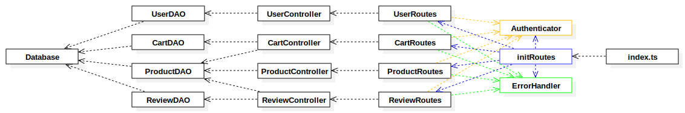

# Test Report

<The goal of this document is to explain how the application was tested, detailing how the test cases were defined and what they cover>

## Contents

- [Test Report](#test-report)
  - [Contents](#contents)
  - [Dependency graph](#dependency-graph)
  - [Integration approach](#integration-approach)
  - [Tests](#tests)
  - [Coverage](#coverage)
    - [Coverage of FR](#coverage-of-fr)
    - [Coverage white box](#coverage-white-box)

## Dependency graph

## Integration approach

Tests are organized in three principal categories and are performed using the Jest testing framework.
The three categories are:

- **Unit tests**: These tests are used to test the smallest units of the application, such as functions, classes, or modules. They are used to ensure that each unit of the software performs as designed. For each module, dependencies are mocked.
  - firstly DAO modules are tested, which depends only on the database. These modules are `UserDAO`, `CartDAO`, `ProductDAO` and `ReviewDAO`
  - the second step is to test the controllers, whose role is to perform the logic of the application. These modules are `UserController`, `CartController`, `ProductController` and `ReviewController`. They depends on the DAO modules.
  - finally, the Routes are tested. These modules are `UserRoutes`, `CartRoutes`, `ProductRoutes` and `ReviewRoutes`. They depends on the controllers, `Authenticator`, and `ErrorHandler`
- **Integration tests**: These tests are used to test the integration between different units of the application. They are used to ensure that the different units of the software work together as expected.
  - the integration tests are performed on the routes, which are the entry points of the application.For each route the output in the database is checked, so that the entire flow (from the API call to the DB) is tested.
- **Acceptance tests**: These tests are used to test the application as a whole. They are used to ensure that the application meets the requirements of the user.
  - the acceptance tests are performed on the API. These test are written by the committee (course managers)

## Tests

<in the table below list the test cases defined For each test report the object tested, the test level (API, integration, unit) and the technique used to define the test case (BB/ eq partitioning, BB/ boundary, WB/ statement coverage, etc)> <split the table if needed>

| Test case name | Object(s) tested | Test level | Technique used |
| :------------: | :--------------: | :--------: | :------------: |
|                |                  |            |                |

## Coverage

### Coverage of FR

<Report in the following table the coverage of functional requirements and scenarios(from official requirements) >

| Functional Requirement or scenario | Test(s) |
| :--------------------------------: | :-----: |
|                FR1                 |         |
|               FR1.1                |         |
|               FR1.2                |         |
|               FR1.3                |         |
|                FR2                 |         |
|               FR2.1                |         |
|               FR2.2                |         |
|               FR2.3                |         |
|               FR2.4                |         |
|               FR2.5                |         |
|               FR2.6                |         |
|                FR3                 |         |
|               FR3.1                |         |
|               FR3.2                |         |
|               FR3.3                |         |
|               FR3.4                |         |
|              FR3.4.1               |         |
|               FR3.5                |         |
|              FR3.5.1               |         |
|               FR3.6                |         |
|              FR3.6.1               |         |
|               FR3.7                |         |
|               FR3.8                |         |
|                FR4                 |         |
|               FR4.1                |         |
|               FR4.2                |         |
|               FR4.3                |         |
|               FR4.4                |         |
|               FR4.5                |         |
|                FR5                 |         |
|               FR5.1                |         |
|               FR5.2                |         |
|               FR5.3                |         |
|               FR5.4                |         |
|               FR5.5                |         |
|               FR5.6                |         |
|               FR5.7                |         |
|               FR5.8                |         |

### Coverage white box

Report here the screenshot of coverage values obtained with jest-- coverage
